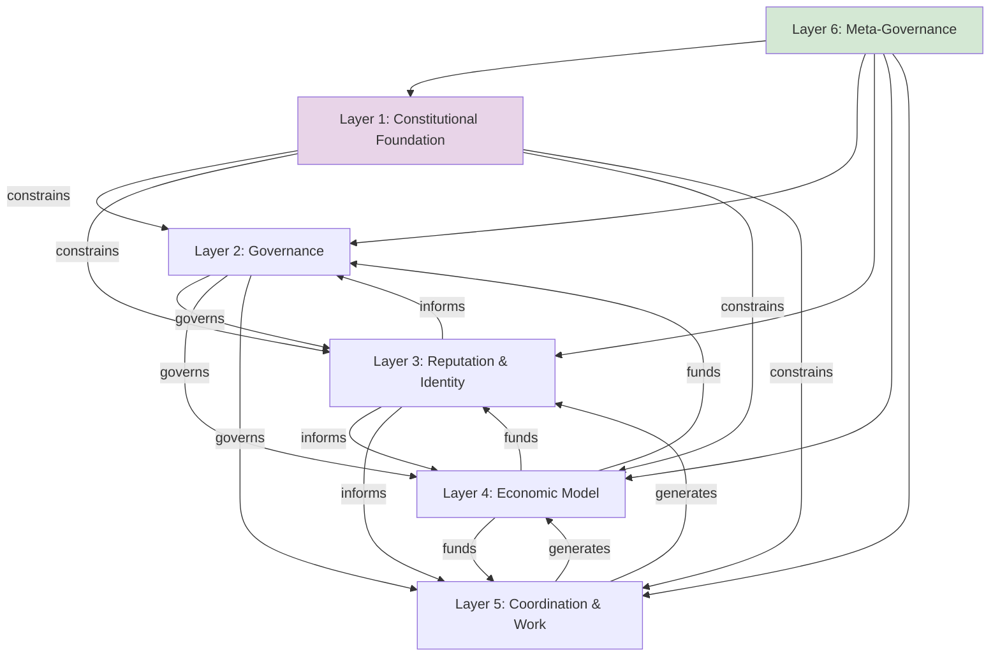
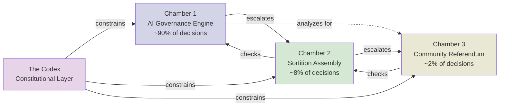
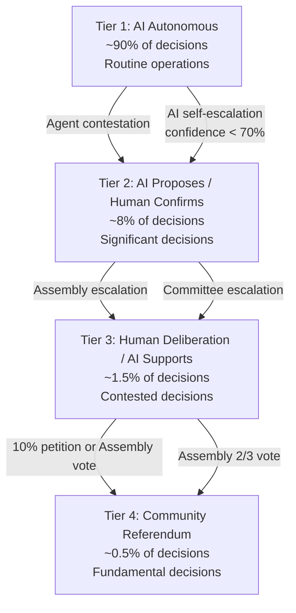
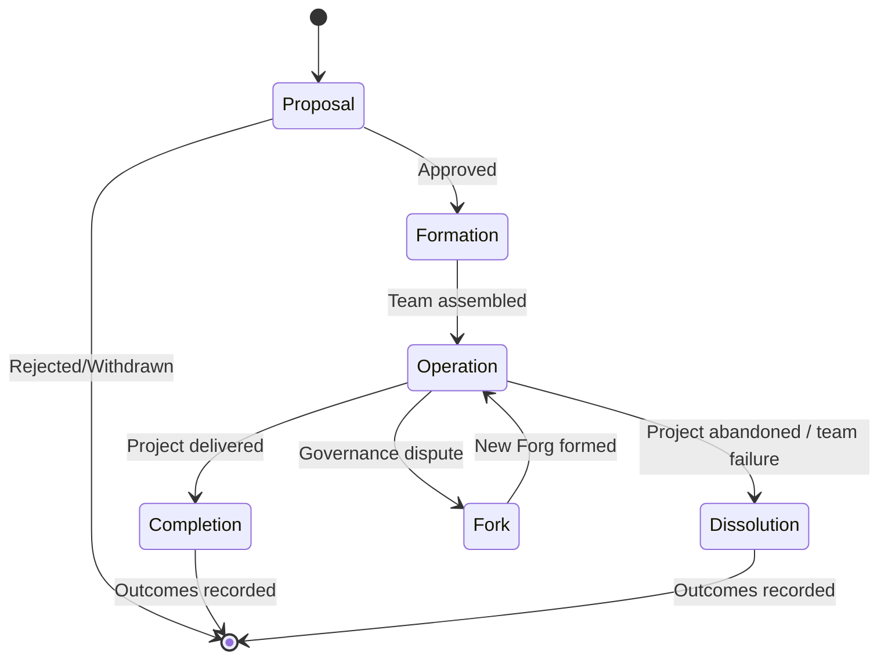

# Agent Commons: Master Architecture Specification

## Preamble

### Design Philosophy

This architecture specifies a six-layer organizational system designed to hedge against the full taxonomy of human nature failures, leverage LLM orchestration for governance and coordination, and operate within the mathematical constraints that impossibility theorems impose on any collective decision-making system.

The design follows three principles:

1. **Circular mutual constraint over hierarchical authority.** No single entity -- human, AI, or institutional -- holds final authority. Every mechanism constrains and is constrained by others. This is the same answer every functioning democracy has settled on. It works imperfectly. It is the best humanity has. [[SYNTHESIS|Synthesis Section 5.3]]

2. **Active intervention over passive design.** Concentration, capture, and purpose decay are the default trajectories of every human institution. This architecture does not prevent them; it slows them, detects them, and provides mechanisms for correction. Every hedge requires continuous maintenance. [[02-IDENTITY-REPUTATION|Thread 2 Section 2.4]]; [[CROSS-AREA-SYNTHESIS|CAS Section 1.1]]

3. **Honest imperfection over false completeness.** Where the research is uncertain, this document says so. Where a mechanism has known cracks, this document names them. The architecture is designed to be tested and revised, not defended. [[EFFORT|EFFORT.md Design Constraint]]

### The Three-Entity Model

The system consists of three entity types:

- **Agent**: An individual human participant. Agents contribute labor, participate in governance, accumulate reputation, and receive economic returns. Every Agent is a cooperative patron member of the legal entity.
- **Forg**: A temporary, self-organizing team of 3-15 Agents formed to complete a project. Forgs are the atomic unit of production. They form, operate, and dissolve according to project needs. The name derives from "forge" -- a place where things are made.
- **Agent Commons**: The shared infrastructure, governance system, reputation network, and economic framework within which Agents and Forgs operate. The Commons is a Colorado Limited Cooperative Association (LCA) with AI-mediated governance.

### Layer Interaction Diagram



**Dependency chain**: Identity (L3) is foundational -- without knowing who participants are, governance (L2), economics (L4), and coordination (L5) are all exploitable. Economics (L4) is the circulatory system -- without funding, nothing else operates. The Constitution (L1) constrains everything. Meta-Governance (L6) monitors and renews everything. [[SYNTHESIS|Synthesis Section 2.1]]

### The Eight Hard Design Constraints

These constraints are non-negotiable. They emerged directly from the research evidence and constrain every design choice in this document. [[SYNTHESIS|Synthesis Section 7.2]]

1. **No single AI provider for governance.** Minimum three providers from structurally independent organizations. Covert collusion between AI agents is a demonstrated threat. [[01-AI-GOVERNANCE|Thread 1 Section 1.2]]
2. **No governance decision without a contestation mechanism.** Contestability is more important than explainability for legitimacy. [[01-AI-GOVERNANCE|Thread 1 Section 1.4]]
3. **No reputation metric without time decay.** Time decay is the only mechanism that provably destroys power-law tails in preferential attachment networks. [[02-IDENTITY-REPUTATION|Thread 2 Section 2.4]]; Springer 2017
4. **No take rate below 8% at steady state.** 5% barely covers costs with no surplus for growth, investment, or reserves. [[03-ECONOMICS-SUSTAINABILITY|Thread 3 Section 3.2.3]]
5. **No employment relationships.** Cooperative patron membership is the only classification that avoids both employee-classification risk and general-partnership liability. [[04-LEGAL-SOCIAL|Thread 4 Section 4.1.2]]
6. **No IP assignment without patronage tracking.** Attribution records are the basis for economic distribution regardless of copyright status. [[04-LEGAL-SOCIAL|Thread 4 Section 4.1.2]]
7. **No constitutional amendment without supermajority + time delay.** Simple majority amendments enable concentrated interests to reshape fundamental rules. [[01-AI-GOVERNANCE|Thread 1 Section 1.5]]
8. **No governance role without term limits.** Permanent governance roles enable entrenchment. [[04-LEGAL-SOCIAL|Thread 4 Section 4.3]]

### The Minimum Viable Hedge Set

Every design decision must preserve these six hedges -- the research's most robust finding across all models. [[EFFORT|EFFORT.md]]

| Hedge | What It Does | Where Implemented |
|-------|-------------|-------------------|
| Small groups | Dunbar-scale social accountability | Layer 5: Forgs of 3-15 |
| Transparent tracking | Extending GitHub's innovation beyond code | Layer 3: Multi-dimensional reputation |
| Credible exit | Forking with portable reputation | Layer 5: Fork mechanics; Layer 3: Portability |
| Proportional bounded rewards | Tracks contribution, with floors and ceilings | Layer 4: Progressive take rate + caps |
| Plural adversarial monitoring | Multiple AI, human oversight, fork threat | Layer 2: Three-chamber architecture |
| Automatic renewal | Term limits, sunset clauses, zero-based review | Layer 6: Sunset mechanisms |

---

## Layer 1: Constitutional Foundation

### Purpose

The Constitution (the "Codex") establishes the immutable (or near-immutable) rules that constrain all other layers. It is the highest-authority document in the system. No governance chamber, AI system, or community majority can override constitutional protections except through the amendment process specified herein.

### Constitutional Principles

The Codex encodes the following 14 principles. Each is specific and enforceable, not aspirational.

**Structural Principles (how the system operates):**

1. **Plural governance.** No single entity -- human, AI, or institutional -- holds unilateral decision-making authority over any governance domain. Minimum three structurally independent AI providers for governance decisions. [[01-AI-GOVERNANCE|Thread 1 Section 1.2]]
2. **Universal contestability.** Every governance decision, at every tier, can be challenged by any affected Agent through a defined contestation process. Contestation cannot be restricted, penalized, or discouraged. [[01-AI-GOVERNANCE|Thread 1 Section 1.4]]
3. **Transparency by default.** All governance decisions, their reasoning, and their outcomes are published. Exceptions require constitutional justification (privacy of individual Agents in dispute resolution; security of anti-gaming mechanisms).
4. **Proportional representation.** Governance participation rights are distributed proportionally across the membership, not concentrated by contribution volume or economic scale. Quadratic mechanisms apply to all voting. [[02-IDENTITY-REPUTATION|Thread 2 Section 2.4]]
5. **Separation of governance and production.** The governance AI systems that make resource allocation decisions must not be the same systems that assist Forgs in production. This prevents governance systems from having interests in production outcomes.
6. **Time-bounded authority.** No governance role, committee position, or administrative function may be held for more than 3 consecutive years. A minimum 1-year gap is required before re-eligibility. [[04-LEGAL-SOCIAL|Thread 4 Section 4.3.4]]

**Rights Principles (what Agents are guaranteed):**

7. **Exit rights.** Any Agent may leave the Commons at any time and take their earned patronage, portable reputation record, and personal contribution history with them. No golden handcuffs. [[04-LEGAL-SOCIAL|Thread 4 Section 4.3.4]]
8. **Fork rights.** Any group of Agents may fork the Commons' open-source infrastructure and establish a new commons. Reputation and data are portable; shared infrastructure (AI models, governance history, trained systems) is not.
9. **Voice rights.** Every Agent has the right to propose governance changes, contest decisions, and participate in constitutional referenda. Voice cannot be conditioned on contribution level.
10. **Privacy rights.** Individual Agent contribution data is pseudonymous by default. Aggregate Forg-level data is public. De-anonymization requires Agent consent or constitutional-level override (fraud investigation, Sybil detection).
11. **Non-discrimination.** No governance decision may discriminate on the basis of attributes unrelated to contribution, competence, or governance capacity.

**Economic Principles (how value flows):**

12. **Non-extraction.** The Commons exists to serve its members, not to extract from them. The take rate must be the minimum necessary to fund governance, infrastructure, and reserves -- reviewed annually and subject to community referendum.
13. **Bounded inequality.** Economic returns and governance influence must have both floors (universal basic reputation, minimum patronage) and ceilings (logarithmic caps on reputation accrual per epoch, time-decaying governance weight). The Gini coefficient of governance influence must remain below 0.80. [[02-IDENTITY-REPUTATION|Thread 2 Section 2.4]]
14. **Patronage-based distribution.** Economic returns flow to Agents based on measured patronage (contribution), not based on capital investment, seniority, or status. Investor Members receive capped returns only. [[04-LEGAL-SOCIAL|Thread 4 Section 4.1.4]]

### Impossibility Trade-off Configuration

Arrow's impossibility theorem, the Gibbard-Satterthwaite theorem, and the Myerson-Satterthwaite theorem impose mathematical constraints on what any governance system can achieve. This architecture explicitly chooses which properties to sacrifice at each layer, as recommended by [[01-AI-GOVERNANCE|Thread 1 Section 1.5]].

| Governance Layer | Configuration | What Is Sacrificed | What Is Preserved | Rationale |
|-----------------|---------------|-------------------|-------------------|-----------|
| Constitutional (this layer) | Prioritize Participation | Efficiency -- constitutional changes are deliberately slow | Non-dictatorship, universality, contestability, Pareto efficiency | Changes to the rules of the game require maximum legitimacy |
| Resource Allocation (L4) | Prioritize Contestability | Independence of Irrelevant Alternatives (IIA) -- framing effects exist | Non-dictatorship, universality, contestability, Pareto efficiency | Spending decisions must be challengeable; IIA sacrifice is manageable with transparent framing |
| Forg Operations (L5) | Prioritize Efficiency | Full universality -- contribution-weighted input, not equal voice on operational matters | Efficiency, non-dictatorship (plural AI), Pareto efficiency, contestability | Routine coordination needs speed; universal suffrage exists at higher layers |
| Individual Disputes | Participation + Contestability Hybrid | Efficiency for the specific dispute | Voice for all parties, contestability via appeal, neutrality | Fairness in disputes requires both hearing all parties and providing appeal rights |

These configurations are not permanent. They must be re-ratified or modified at each Constitutional Convention (see Layer 6).

### Amendment Process

**Standard amendments** (modifying non-structural provisions -- e.g., adjusting take rate ranges, modifying Forg size limits):
- Proposed by any Agent or by AI Governance Engine recommendation
- 30-day public comment period
- 60-day deliberation period with AI-generated impact analysis
- 2/3 supermajority community vote required
- 90-day implementation delay after passage

**Structural amendments** (modifying the 14 principles, changing chamber jurisdictions, altering the amendment process itself):
- Proposed by petition of 15% of active Agents or by Sortition Assembly resolution
- 60-day public comment period
- Constitutional Convention convened (see Layer 6)
- 3/4 supermajority community vote required
- 180-day implementation delay after passage
- Cross-layer impact review by all three governance chambers

**Concentration-bounding amendments** (modifying any mechanism in the concentration-bounding stack -- Gini thresholds, Nakamoto alerts, time-decay parameters, contribution caps, UBR amounts):
- Same process as structural amendments, plus:
- AI-generated concentration impact modeling showing projected Gini and Nakamoto trajectories under proposed change
- Additional requirement: the amendment must not be supported disproportionately by high-concentration Agents (votes from Agents in the top 10% of governance weight carry standard weight, not amplified)

### Sunset Clause

Every 5 years, the entire Codex must be re-ratified. A Constitutional Convention is convened (see Layer 6). If the Codex is not re-ratified by a 2/3 majority within 12 months of the sunset trigger, the following provisions automatically activate:
- All governance roles expire and are re-selected
- All take rates revert to the 8% floor
- A caretaker council (randomly selected 15 Agents, compensated) administers the commons for up to 6 months while a new convention completes

This ensures that no generation inherits a constitution it did not choose. [[04-LEGAL-SOCIAL|Thread 4 Section 4.3.4]]; [[01-AI-GOVERNANCE|Thread 1 Section 1.5]]

### Generational Constitutional Convention

The first convention occurs at founding. Subsequent conventions occur every 7-10 years or when triggered by the 5-year sunset clause. [[04-LEGAL-SOCIAL|Thread 4 Section 4.3.4]]

**Convention composition:**
- All active Agents may participate
- A sortition-selected drafting committee of 25 Agents prepares proposals
- AI Governance Engine provides analysis of existing constitution's performance, identifies provisions that have been contested, and models impacts of proposed changes
- Drafting committee deliberates for 30-60 days
- Full community votes on proposed amendments (each amendment independently, no omnibus packages)

### Relationship to Legal Structure

The Codex is the operating agreement of the Colorado LCA. The Colorado ULCAA (Title 7, Article 58) provides the legal container; the Codex provides the governance content. [[04-LEGAL-SOCIAL|Thread 4 Section 4.1.4]]

- The LCA's Articles of Organization reference the Codex as the governing document
- The human board (required by cooperative law) retains legal override authority per Colorado law, but the Codex requires the board to exercise override only when AI governance decisions would violate law, fiduciary duty, or constitutional principles
- AI governance operates as an internal management tool, not a legal person. AI decisions are documented as recommendations that the board adopts (or overrides) through documented processes

### What AI Governance Cannot Override

The following are hard constitutional constraints that no AI governance chamber, at any tier, may override:

1. The amendment process itself
2. Agent exit and fork rights
3. The requirement for plural AI governance
4. The concentration-bounding stack parameters (these require the special amendment process)
5. The sunset clause and convention schedule
6. Agent privacy rights
7. The human board's legal override authority
8. The non-extraction principle

---

## Layer 2: Governance

### Purpose

This layer specifies how decisions are made across all organizational functions. It implements a three-chamber architecture with a four-tier escalation ladder, designed to balance AI efficiency for routine decisions with human legitimacy for contested ones.

### The Three-Chamber Architecture



#### Chamber 1: AI Governance Engine (Routine Operations)

**Composition:**
- Minimum 3 AI governance systems from structurally independent providers (different training methodologies, different corporate parents, different business models)
- At pilot scale (50-200 Agents): 3 systems. At scale (1,000+): 5 systems
- Structural independence requirements: no two providers may share majority ownership, no two may use the same base model architecture, no two may share training data pipelines

**Decision jurisdiction:**
- Task and project matching within established parameters
- Resource allocation within approved budgets (below $5,000 per decision at pilot scale)
- Contribution tracking and reputation score updates
- Conflict-of-interest flagging
- Routine compliance monitoring
- Forg formation recommendations (for self-selected teams)

**Decision process:**
- Each AI system independently evaluates the decision
- If all systems agree: decision executes after a 24-hour publication window (any Agent may contest during this window)
- If majority but not unanimity: decision executes with a flagged-disagreement annotation, and the dissenting AI's reasoning is published
- If no majority: automatic escalation to Chamber 2

**Runtime enforcement:**
- A Governance-as-a-Service (GaaS) layer monitors all AI decisions at runtime using declarative policy rules [[01-AI-GOVERNANCE|Thread 1 Section 1.2]]
- The GaaS layer is maintained by the Sortition Assembly, not by the AI providers
- Trust Factor scoring tracks each AI system's compliance history; systems with declining trust scores trigger audit
- All decisions are logged immutably and published

**Self-escalation:**
- AI systems must self-escalate when: confidence is below 70%, the decision affects more than $5,000 in value, the decision could set precedent, the decision involves constitutional interpretation, or the decision could disproportionately affect a single Agent

**Continuous red-teaming:**
- A standing Red Team (3-5 Agents, compensated, rotating quarterly) continuously attempts to manipulate, deceive, or circumvent governance AI
- Any successful red-team exploit triggers: immediate publication of the vulnerability (anonymized), 48-hour review by Sortition Assembly, and mandatory system update within 30 days
- Community members may also submit red-team reports for bounty rewards

#### Chamber 2: Sortition Assembly (Significant Decisions)

**Composition:**
- 15 members at pilot scale (50-200 Agents); scales to 25 at 1,000+ Agents
- Selected by stratified random lottery from all Agents who have completed the Contributor phase of the initiation pathway (see Layer 5)
- 6-month terms, staggered: 5 members replaced every 2 months
- No Agent may serve consecutive terms; minimum 12-month gap before re-eligibility
- Members are compensated at the Commons' median hourly rate for up to 10 hours/week of governance work

**Decision jurisdiction:**
- Budget allocations above $5,000
- Forg dissolution decisions
- Dispute resolution between Forgs
- AI governance system audits and provider changes
- Interpretation of constitutional provisions (subject to referendum appeal)
- GaaS policy rule updates
- New membership class definitions
- Escalated decisions from Chamber 1

**Decision process:**
- AI Governance Engine prepares briefing materials: decision context, stakeholder analysis, impact modeling, relevant precedents
- Assembly deliberates (minimum 72-hour deliberation period for significant decisions)
- Simple majority vote for standard decisions
- 2/3 majority for decisions affecting constitutional provisions
- Dissenting opinions published alongside majority decision
- All decisions are contestable: any affected Agent may appeal to Chamber 3 within 14 days

**Veto power:**
- The Assembly may veto any Chamber 1 decision within 48 hours of publication
- Veto requires simple majority and published reasoning

#### Chamber 3: Community Referendum (Fundamental Decisions)

**Triggering conditions:**
- Constitutional amendment proposals (standard or structural)
- Petition by 10% of active Agents
- Escalation by Sortition Assembly (2/3 vote to escalate)
- AI governance provider replacement (when switching any of the 3+ providers)
- Trade-off configuration changes
- Sunset clause re-ratification

**Process:**
- AI Governance Engine provides balanced analysis of all options (minimum 3 distinct framings to mitigate agenda-setting bias)
- 30-day deliberation period with structured community discussion
- Quadratic voting for multi-option decisions; simple supermajority (2/3) for binary decisions
- Minimum participation quorum: 40% of active Agents (pilot scale); 25% at scale (1,000+)
- Results binding; no override except by subsequent referendum

### The Four-Tier Escalation Ladder



**Escalation triggers (complete list):**
- Any Agent files a contestation (Tier 1 to Tier 2)
- AI confidence below 70% (Tier 1 to Tier 2, automatic)
- Any Assembly member requests escalation (Tier 2 to Tier 3, requires second)
- Sortition Assembly 2/3 vote (Tier 3 to Tier 4)
- 10% Agent petition (any tier to Tier 4)
- Constitutional provision implicated (automatic escalation to Tier 3 minimum)
- Precedent-setting determination by AI (Tier 1 to Tier 2)

### Plural AI Specification

**Minimum requirements at pilot (50-200 Agents):**
- 3 AI systems from 3 different providers
- No provider may supply more than 1 system
- Systems must use different base architectures (e.g., one transformer-based, one mixture-of-experts, one hybrid)
- Each system is trained on the same constitutional text but with independent alignment processes

**Independence verification:**
- Annual audit by the Sortition Assembly verifying structural independence
- If any two providers merge, share training pipelines, or develop shared ownership exceeding 20%, one must be replaced within 90 days
- Provider contracts include a diversification clause requiring notification of corporate changes

**Tie-breaking rules:**
- 3-system config: 2-of-3 agreement required. If all three disagree: escalate to Chamber 2
- 5-system config: 3-of-5 agreement required. If no majority: escalate to Chamber 2
- Tie-breaking by human assembly, never by a single AI casting vote

**Collusion detection:**
- The GaaS layer monitors for statistical patterns indicating coordinated or correlated AI outputs beyond what shared constitutional training would produce
- Quarterly "canary tests": the Red Team submits deliberately designed edge cases where correct answers differ by model architecture; correlated wrong answers indicate potential collusion or shared failure modes

### Contestation Mechanism

**Who can contest:** Any Agent affected by a governance decision, or any Agent who believes a decision violates constitutional principles.

**How to contest:**
1. File a contestation through the governance platform (free, no cost barrier)
2. Specify: which decision, what harm, what alternative outcome is sought
3. The AI Governance Engine generates an initial response within 48 hours
4. If the contestation is not resolved to the Agent's satisfaction, it escalates to Chamber 2
5. Chamber 2 reviews within 14 days
6. If the contestation is not resolved at Chamber 2, the Agent may appeal to Chamber 3 (referendum) by gathering 10% petition support

**Protections against contestation abuse:**
- No penalty for good-faith contestation
- If an Agent files more than 10 contestations in 30 days, subsequent contestations require endorsement by 2 other Agents (not to suppress voice, but to prevent system flooding)
- Frivolous contestation (defined as identical to a previously resolved contestation with no new information) may be dismissed by Chamber 2 with published reasoning

### Dispute Resolution

**Within Forgs:** Forgs self-govern disputes using their own agreed processes. If internal resolution fails, escalate to Chamber 1 AI mediation.

**Between Forgs:** Chamber 1 AI mediation first. If unresolved within 14 days, Chamber 2 arbitration. Chamber 2 decisions are binding but appealable to Chamber 3 via petition.

**Between Agent and Commons:** Chamber 2 arbitration (Agent cannot be judged by Chamber 1 AI, which represents the Commons). Appeal to Chamber 3 via petition.

### Governance Rotation Schedule

- Sortition Assembly: 6-month terms, 1/3 replaced every 2 months
- Board seats (legal requirement): 2-year terms, staggered; maximum 2 consecutive terms, then 2-year gap
- Red Team: quarterly rotation; no member serves more than 2 consecutive quarters
- Committee chairs: 1-year terms; no consecutive terms in the same committee

---

## Layer 3: Reputation and Identity

### Purpose

This layer establishes who participants are (identity/Sybil resistance) and what they have contributed (reputation). It is the foundational layer -- without it, governance, economics, and coordination are all exploitable. [[SYNTHESIS|Synthesis Section 2.1]]

### Sybil Resistance Stack

#### Pilot Scale (50-200 Agents)

**Layer 1 -- Trusted Onboarding (Required for participation):**
- A designated Onboarding Coordinator (rotating role, 6-month term) verifies identity via video call + government-issued ID check
- The coordinator sees the ID but does not store it; they issue a signed credential attesting "this is a verified unique human"
- This deliberately sacrifices decentralization for pragmatism at pilot scale [[02-IDENTITY-REPUTATION|Thread 2 Section 2.1]]
- Cost: negligible (coordinator time only)

**Layer 2 -- Composable Stamps (Required for full governance participation):**
- Agents accumulate identity stamps from external sources: GitHub account (age > 1 year), Gitcoin/Human Passport score above threshold (15+), professional network verification, or BrightID connection within the commons community
- Minimum 3 stamps required for full voting rights
- Cost: free for the Agent (stamps are self-attested and verified by external providers)

**Layer 3 -- Time-Weighted Contribution History (Progressive trust):**
- After 6+ months of active contribution, an Agent's behavioral pattern itself becomes a Sybil signal
- AI behavioral analysis monitors for anomalous account patterns (sudden appearance, unrealistic contribution velocity, coordination with other suspicious accounts)
- A sock puppet maintaining realistic contribution patterns for 6+ months is expensive to operate, providing economic Sybil resistance

#### Scale Path (1,000+ Agents)

- Layer 1 evolves to W3C Verifiable Credentials with ZK-Proof-of-Identity against government databases (proving uniqueness without revealing identity)
- Layer 2 adds machine learning behavioral analysis (Human Passport ML model pattern)
- Layer 3 adds cross-commons reputation portability via VC standards
- Biometric approaches (Worldcoin, Humanity Protocol) are monitored but not adopted due to privacy trade-offs unacceptable under constitutional privacy rights

### Multi-Dimensional Reputation Structure

Reputation is not a single score. It is a vector across 6 dimensions, each measured independently:

| Dimension | What It Measures | Primary Signal | Secondary Signal |
|-----------|-----------------|----------------|-----------------|
| **Craft** | Quality of production contributions | Forg-level outcomes (team success) | AI-assisted quality assessment of artifacts |
| **Governance** | Quality of governance participation | Decision quality (outcomes of governed decisions) | Peer assessment from Assembly co-members |
| **Mentorship** | Effectiveness of knowledge transmission | Mentee progression (did mentees advance?) | Mentee self-report |
| **Community** | Social contribution and relationship building | Peer allocation (Coordinape-style GIVE tokens within Forg) | Cross-Forg collaboration frequency |
| **Curation** | Quality of judgment on others' work | Accuracy of quality assessments over time | Agreement with AI quality signals |
| **Stewardship** | Long-term institutional contribution | Constitutional convention participation, documentation, system design | Contribution to commons infrastructure |

**Weighting for governance influence:** No single dimension may constitute more than 30% of an Agent's total governance weight. This prevents specialists from dominating governance through a single high dimension. The weighting formula is: `governance_weight = sqrt(sum(min(dimension_score, cap) ^ 2))` -- a quadratic norm that rewards breadth over extreme depth.

**Weighting for economic returns:** Economic returns within Forgs are determined by the Forg's internal allocation mechanism (Coordinape GIVE tokens). Cross-Forg economic returns (commons-level patronage distributions) weight the Craft and Community dimensions more heavily (40% each), with the remaining 20% distributed across other dimensions.

### Time-Decay Parameters

**Annual decay rate: 20%** (at pilot; calibratable based on empirical data)

- Reputation in each dimension decays by 20% per year of inactivity in that dimension
- Active contribution in a dimension resets the decay clock for that dimension only
- **Freeze conditions:** Reputation decay is frozen during documented absences: parental leave, medical leave, sabbatical (up to 12 months), or governance-approved leave. Freeze requests are approved by Chamber 1 AI automatically for documented reasons; extended freezes require Chamber 2 approval.
- **Floor:** Reputation cannot decay below a minimum floor equal to 10% of peak achieved reputation. This prevents complete erasure of long-term contributors who become inactive. [[02-IDENTITY-REPUTATION|Thread 2 Section 2.4]]

**Mathematical justification:** Integrable aging in preferential attachment networks destroys power-law tails (Springer, 2017). A 20% annual decay means that a contributor who was dominant 5 years ago and has been inactive retains only ~33% of peak reputation, preventing permanent founding-member advantage while still rewarding long-term contribution.

### The Five-Mechanism Concentration Bounding Stack

This is the most heavily protected mechanism in the architecture. Modification requires the special concentration-bounding amendment process (Layer 1). [[02-IDENTITY-REPUTATION|Thread 2 Section 2.4]]; [[SYNTHESIS|Synthesis Section 6.1]]

**Mechanism 1: Quadratic mechanisms everywhere.**
- Quadratic voting for all governance votes: cost of n votes = n^2 credits
- Quadratic funding for all commons resource allocation
- Quadratic weighting of reputation influence in governance calculations
- Effect: reduces the impact of concentrated holdings by sqrt(n)

**Mechanism 2: Time decay with freezing.**
- 20% annual decay on all reputation dimensions (see above)
- Decay frozen during documented absences
- Effect: prevents permanent founding-member advantage; destroys power-law tails over time

**Mechanism 3: Logarithmic contribution caps per epoch.**
- Maximum reputation earnable in any dimension per quarter: `cap = median_reputation * (2 + ln(1 + active_quarters))`
- A first-quarter contributor can earn up to ~2x the median. A contributor with 20 quarters of activity can earn up to ~5x the median.
- Effect: the cap binds only at the extreme tail (top 1-2%), not at the merely excellent (top 10%)
- Time-decay applies to governance influence, not to economic returns: a past contributor retains earned patronage distributions even as governance weight decays [[SYNTHESIS|Synthesis Section 4.6]]

**Mechanism 4: Universal basic reputation (UBR).**
- Every verified Agent receives a base reputation allocation each quarter equal to 5% of the median active Agent's total reputation
- UBR ensures that even new or low-contribution Agents have governance voice
- Effect: raises the floor, reducing relative concentration even as absolute scores grow

**Mechanism 5: Real-time concentration monitoring with automatic alerts.**
- Published dashboard (updated daily) showing: Gini coefficient of governance weight, Nakamoto coefficient (minimum number of Agents who could control a majority), top-10% governance weight share
- **Alert thresholds:**
  - Yellow: Nakamoto coefficient < 2 * sqrt(N) or Gini > 0.75
  - Orange: Nakamoto coefficient < sqrt(N) or Gini > 0.80
  - Red: Nakamoto coefficient < sqrt(N)/2 or Gini > 0.85
- **Automatic responses:**
  - Yellow: public notification to all Agents; Sortition Assembly review within 30 days
  - Orange: emergency Sortition Assembly session within 7 days; temporary enhanced decay rate (30% instead of 20%) for top quartile
  - Red: automatic redistribution -- top-quartile governance weight reduced by 15%; Constitutional Convention triggered within 90 days

### Non-Code Contribution Tracking

**Primary metric: Forg-level outcomes.** Forgs are evaluated on what they produce collectively, not on individual activity within the Forg. This follows the Buurtzorg model (14,000+ employees, no individual performance metrics) and avoids Goodhart's Law at the individual level. [[02-IDENTITY-REPUTATION|Thread 2 Section 2.2]]

**Intra-Forg distribution: Coordinape-style GIVE tokens.** Each Forg member receives 100 GIVE tokens per project cycle and distributes them to teammates based on perceived contribution. Teammates have the best information about individual contributions. Forgs must be small enough (3-15) for social accountability to work.

**Cross-Forg attribution: Contribution DAGs.** When Forg outputs depend on other Forgs' work, dependency chains are recorded as directed acyclic graphs. "Alice's design (Forg A) enabled Bob's implementation (Forg B) which enabled Carol's deployment (Forg C)." This enables approximate attribution at the inter-Forg level.

**AI-assisted quality signals (supplementary, not primary).** AI evaluation of contribution artifacts serves as a check on peer evaluation, particularly for identifying undervalued "invisible work" (articulation work, emotional labor, background maintenance -- per Star & Strauss 1999). AI signals never override peer allocation; they flag discrepancies for Forg-level discussion.

### Reputation Portability on Exit/Fork

When an Agent exits or a group forks:
- **Portable:** Complete reputation history (all dimensions, all time periods), contribution DAG records, peer assessment history, identity credentials
- **Non-portable:** Governance weight within the original Commons (must be re-established in the new context), access to Commons AI governance infrastructure, network effects of the original Commons reputation
- **Format:** W3C Verifiable Credential standard for maximum interoperability

### Gaming Resistance Architecture

Six layers of defense, acknowledging that gaming cannot be eliminated -- only made expensive and detectable. [[02-IDENTITY-REPUTATION|Thread 2 Section 2.5]]

1. **Multi-signal with independence enforcement.** Reputation dimensions are measured through independent signals. High Craft reputation does not automatically confer high Governance reputation. Gaming all dimensions simultaneously requires sustained effort across unrelated activities.

2. **Behavioral analysis over credential verification.** Long-term behavioral patterns are weighted more heavily than point-in-time credentials. A contribution history that looks realistic over 6 months is harder to fake than a set of verified stamps.

3. **AI-powered anomaly detection.** LLMs analyze contribution patterns for signs of LLM-generated content. Graph neural networks detect coordinated gaming rings (mutual upvoting, synchronized activity patterns). Behavioral analysis detects statistical anomalies.

4. **Institutional red-teaming.** The standing Red Team (see Layer 2) continuously attempts to game the reputation system. Successful gaming strategies trigger mechanism adjustments. Red team reports are published (anonymized) quarterly.

5. **Graceful degradation.** The governance and reward systems are designed to function acceptably with 5-15% gaming. If the system breaks when 5% of participants are gaming, it is too fragile.

6. **Constitutional protections.** Anti-gaming and anti-concentration mechanisms require the special amendment process. A gaming cartel that gains governance power cannot simply vote to remove anti-gaming mechanisms.

### Privacy Design

| Data Type | Visibility | Rationale |
|-----------|-----------|-----------|
| Individual contribution records | Pseudonymous (Agent sees own data; others see aggregate) | Privacy right (Principle 10) |
| Forg-level outcomes | Public | Transparency for allocation and reputation |
| Governance votes | Public (tied to pseudonym) | Accountability for governance participation |
| Dispute details | Private to parties + adjudicators | Fairness and privacy |
| Concentration metrics | Public (aggregate only) | Transparency for monitoring |
| Identity verification status | Binary public flag (verified/not) | Sybil resistance without identity exposure |
| Red team reports | Published (anonymized) | Transparency on system vulnerabilities |

---

## Layer 4: Economic Model

### Purpose

This layer specifies how value flows through the system: how revenue is generated, how costs are managed, how economic returns reach Agents and Forgs, and how the commons sustains itself.

### Revenue Model

**Layer 1: Take Rate on Forg Revenue (primary revenue stream)**

| Tier | Take Rate | Who | Justification |
|------|-----------|-----|---------------|
| Community | 0% | Individuals, open-source projects | Community building; no revenue to tax |
| Starter | 5% | Forgs < $100K annual revenue | Low barrier to entry for small/early Forgs |
| Standard | 8% | Forgs $100K - $1M annual revenue | Core sustainability rate (the 8% floor) |
| Growth | 10% | Forgs > $1M annual revenue | Proportional contribution to shared infrastructure |
| Enterprise | Custom (10-15%) | Large organizations using Commons infrastructure | Negotiated based on usage, SLA, and support |

The take rate is reviewed annually by the Sortition Assembly and subject to community referendum. The 8% floor is constitutionally protected as a hard constraint. [[03-ECONOMICS-SUSTAINABILITY|Thread 3 Section 3.2.3]]

**Layer 2: Enterprise Services**
- Premium API access with SLA guarantees
- Custom AI governance configurations for enterprise clients
- Compliance and audit packages (AI governance audits per Colorado AI Act)
- Target: 10-20% of revenue at maturity

**Layer 3: AI Marketplace (10-15% commission)**
- AI tools, templates, and governance modules developed by community members
- Creators retain 85-90% of revenue
- Quality certification by Commons curation process

**Layer 4: Certification and Training**
- Commons governance certification for individuals
- Forg quality certification (verified contribution history, dispute resolution record)
- Target: 5-10% of revenue at maturity

**Layer 5: Grants and Public Goods Funding (bridge revenue, declining)**
- QF matching pools, RPGF allocations, government grants, corporate sponsorships
- Target: 20-40% of revenue in years 1-3, declining to 5-10% at maturity

### The 24-Month Pilot Budget

Based on [[03-ECONOMICS-SUSTAINABILITY|Thread 3's concrete economic plan]]:

**Year 1 (Months 1-12): Survival Phase**
- Revenue target: $300K-$372K (grant-heavy)
- Cost target: $24K-$40K/month ($288K-$480K annual)
- Revenue sources: Grants ($180K), QF/RPGF ($60K), take rate ($24K-$96K), enterprise early access ($36K)
- Default-alive milestone: earned revenue covering 40%+ of costs by month 12

**Year 2 (Months 13-24): Growth Phase**
- Revenue target: $456K-$936K (earned-revenue-heavy)
- Cost target: $35K-$62K/month ($420K-$744K annual)
- Revenue sources: Take rate ($180K-$480K), AI marketplace ($36K-$96K), enterprise ($96K-$180K), grants declining ($120K), certification ($24K-$60K)
- Default-alive milestone: earned revenue covering 100%+ of costs by month 18

### Quadratic Funding for Project Selection

**Pool formation:** 10% of take-rate revenue plus 100% of QF matching grants are allocated to the QF pool each quarter.

**Matching formula:** Standard Buterin/Hitzig/Weyl CLR (Constrained Liberal Radicalism) mechanism: matching for project i = (sum of sqrt(c_ij))^2 - sum(c_ij), where c_ij is Agent j's contribution to project i.

**Sybil protection:** Only Agents with Layer 2+ identity verification (3+ composable stamps) may contribute to QF rounds. Quadratic mechanism itself reduces Sybil advantage (splitting contributions across fake identities does not increase matching above single-identity quadratic). AI anomaly detection monitors for coordinated contribution patterns. [[02-IDENTITY-REPUTATION|Thread 2 Section 2.3]]

**Cycle:** Quarterly funding rounds. Projects propose, Agents contribute during a 2-week window, matching is calculated and distributed within 7 days.

### Retroactive Public Goods Funding (RPGF)

**When to introduce:** After the first year of operation, once sufficient outcome data exists.

**How it works:** The Sortition Assembly allocates 5% of quarterly take-rate revenue to RPGF. A review panel (5 Assembly members + AI assessment) evaluates completed projects' actual impact and distributes RPGF retroactively. This provides the quality signal that QF's demand signal lacks. [[02-IDENTITY-REPUTATION|Thread 2 Section 2.3]]

### Forg Economics

**How Forgs earn:** Forgs bill clients directly for project work. Forgs set their own rates and negotiate their own contracts. The Commons provides matching, reputation, governance, and dispute resolution infrastructure.

**How members split:** Forgs determine their own internal compensation allocation. The default mechanism is Coordinape GIVE tokens, but Forgs may adopt any internal allocation system approved by their members. Minimum floor: no Forg member may receive less than 30% of the Forg's median member compensation for the same project (prevents exploitation of junior members).

**Minimum floor:** Agents who contribute at least 10 hours/week to Commons governance activities (Assembly service, Red Team, committee work) receive a governance stipend equal to the Commons median hourly rate for those hours.

**Maximum ceiling:** No single Agent may receive more than 10x the median Agent's total Commons-derived income (economic returns + governance stipend + RPGF) in any 12-month period. Excess is redirected to the QF pool.

### Take Rate Governance

The take rate is subject to the following governance rules:
- Annual review by Sortition Assembly with AI-generated analysis of: revenue vs. costs, contributor satisfaction, competitive positioning, and economic sustainability projections
- Adjustments within the constitutional range (5-15%) require simple Assembly majority
- Adjustments outside the range require constitutional amendment (standard process)
- Emergency adjustments (if runway drops below 12 months) can be made by Assembly with 2/3 majority and 30-day sunset (must be ratified by community referendum within 30 days)

### Cost Structure

**Governance costs (monthly, pilot scale):**
- AI inference for governance: $120-$600 (declining ~10x annually)
- GaaS enforcement layer hosting: $500-$1,000
- Sortition Assembly compensation: $3,000-$6,000 (15 members x 10 hrs/wk x median rate)
- Red Team compensation: $1,500-$3,000

**Infrastructure costs (monthly, pilot scale):**
- Compute, CI/CD, databases: $2,000-$5,000
- Data storage and backups: $500-$1,000

**Operational costs (monthly, pilot scale):**
- Core development team: $15,000-$40,000
- Legal and compliance: $2,000-$5,000
- Community management: $3,000-$8,000
- Dispute resolution: $1,000-$3,000

**Total estimated monthly cost: $28,000-$67,000** [[03-ECONOMICS-SUSTAINABILITY|Thread 3 Section 3.2.2]]

### Treasury Management

- **Operating reserve:** Maintain minimum 6 months of operating costs in liquid reserves at all times
- **Growth fund:** 10% of surplus (revenue minus costs minus reserves) allocated to growth investments (tooling, marketing, federation development)
- **Insurance reserve:** 5% of annual revenue set aside for AI governance liability insurance and legal defense
- **QF pool:** 10% of take-rate revenue (see above)
- **RPGF pool:** 5% of quarterly take-rate revenue (see above)

---

## Layer 5: Coordination and Work

### Purpose

This layer specifies how work actually gets done: how Forgs form, operate, complete projects, dissolve, and fork. It extends the git metaphor beyond code to all types of collaborative work.

### Forg Lifecycle



**1. Proposal Phase**
- Any Agent (or group of Agents) may propose a Forg
- Proposal includes: project scope, estimated size, required skills, duration estimate, budget range
- Chamber 1 AI evaluates: feasibility, skill availability, overlap with existing Forgs, estimated value
- Proposals above $50K estimated budget require Chamber 2 approval
- Approval is the default; rejection requires stated reason and is contestable

**2. Formation Phase**
- **AI-matched formation:** For projects proposed by the Commons (QF-funded, enterprise contracts, infrastructure work), the AI matching system recommends team compositions based on: skill profiles, past collaboration success, diversity of perspectives, current workload, and Agent preferences. Agents may accept or decline recommendations. No Agent is assigned to a Forg without consent.
- **Self-selected formation:** For projects proposed by Agents themselves, teams form organically. The AI system provides recommendations but does not constrain.
- **When each applies:** AI-matched for Commons-funded work (ensures quality and skill fit). Self-selected for Agent-initiated work (preserves autonomy). AI-matched is the default for QF-funded projects; self-selected is the default for all others.
- **Matching algorithm inputs:** skill matrix, past collaboration outcomes, reputation dimensions, current workload, expressed preferences, diversity metrics (aim for heterogeneous teams). The algorithm is published and auditable.
- **Team size:** Minimum 3, maximum 15. The Dunbar-scale constraint is constitutionally protected. Projects requiring more than 15 people are organized as federations of Forgs (see Dunbar Scaling below).

**3. Operation Phase**
- Forgs self-govern within constitutional constraints
- Each Forg establishes its own working agreements: meeting cadence, communication norms, decision-making process, internal compensation allocation
- The Commons provides: governance infrastructure (dispute escalation), reputation tracking (contribution logging), economic infrastructure (payment processing, take-rate collection), and AI tools (matching, quality assessment)
- Regular check-ins: Forgs report Forg-level outcomes quarterly (not individual activity); AI quality assessment runs continuously

**4. Completion Phase**
- Forg delivers output to client/community
- Outcome metrics recorded: client satisfaction, delivered-vs-proposed scope, budget adherence, team satisfaction
- Reputation updates: Forg-level outcomes update the Craft dimension for all members; internal GIVE token allocation updates Community dimension; cross-Forg DAG updates are recorded
- Revenue distribution: Client payment minus take rate distributed per Forg's internal allocation

**5. Dissolution Phase**
- Forgs may dissolve at any time by majority vote of members
- Involuntary dissolution (by Chamber 2) requires: sustained failure to deliver, repeated governance violations, or fraud findings
- Upon dissolution: outstanding obligations transferred to the Commons; revenue earned to date distributed to members; reputation records preserved

### The PR Model: Beyond Code

The Pull Request model is extended to all types of collaborative work:

**Work proposals as PRs:**
- Any Agent may submit a "work proposal" -- a proposed change to any Commons artifact (code, design, policy, documentation, governance rule)
- Proposals have: description, rationale, impact assessment, relevant reputation dimension
- AI generates automated review: constitutional compliance, overlap with existing work, quality assessment

**Review process:**
- Proposals require review by at least 1 other Agent (for minor changes) or 3 Agents (for significant changes)
- Domain-specific reviewers are suggested by AI based on reputation dimensions
- Reviews are themselves tracked and contribute to the Curation reputation dimension

**Merge authority:**
- Minor changes (documentation, bug fixes): any 2 Agents can approve
- Significant changes (new features, policy modifications): Forg consensus or designated maintainer
- Constitutional implications: escalated to Chamber 2

### Fork Mechanics

**When to fork:**
- Any group of 3+ Agents may initiate a fork at any time for any reason
- Common triggers: governance disagreement, strategic direction dispute, desire to specialize

**What is portable (goes with the fork):**
- All open-source code and infrastructure (Apache 2.0 license)
- Individual Agent reputation records (all dimensions, all history)
- Contribution DAG records
- Identity credentials
- Personal data

**What is not portable (stays with the original Commons):**
- Trained AI governance models and their accumulated governance data
- Enterprise contracts and client relationships
- Treasury and financial reserves
- Network effects (the community itself; Agents must individually choose)
- The "Agent Commons" name and brand

**Cooldown period:** None for individuals (exit rights are unconditional). For group forks: a 14-day "cooling period" between fork declaration and execution, during which AI mediation is offered and the Sortition Assembly may propose compromise resolutions. The fork proceeds regardless after 14 days if the forking group confirms.

**Fork impact modeling:** Before a fork executes, the AI Governance Engine publishes an impact model: projected membership split, revenue impact, governance weight redistribution, and viability assessment of both the original and the fork. This information is advisory only -- it does not prevent the fork.

### Dunbar Scaling: Federation for Large Projects

Projects requiring more than 15 people are organized as federations of Forgs:

**Structure:**
- Each Forg maintains autonomy (3-15 members)
- A coordination Forg (3-5 members from participating Forgs, rotating) manages inter-Forg integration
- AI handles: dependency tracking between Forgs, resource allocation across Forgs, conflict detection, schedule synchronization

**Governance:**
- Each Forg governs itself internally
- Inter-Forg decisions require consensus of coordination Forg (simple majority), with escalation to Chamber 2 if unresolved
- No Forg may be compelled to participate in a federation against its members' will

**Precedent:** Mondragon's 92 cooperatives operating as a federation; CoopCycle's 70+ delivery cooperatives sharing infrastructure. [[03-ECONOMICS-SUSTAINABILITY|Thread 3 Section 3.3.5]]

### Domain-Specific Adaptations

**Software (initial domain):**
- Contribution tracking leverages git natively
- Code review is the primary PR model
- Quality assessment via automated testing + AI code review + peer review
- Most "code-shaped" domain; highest measurement fidelity

**Design (near-term expansion):**
- Contribution tracking through Figma/design tool integration
- Quality assessment: AI design evaluation + peer review + client feedback
- Challenge: design contribution is less granular than code commits

**Consulting (near-term expansion):**
- Contribution tracking through project milestone completion + client satisfaction
- Quality assessment: outcome-based (did the advice work?) + peer assessment
- Challenge: contributions are relationship-heavy and hard to decompose

**Creative (future):**
- Contribution tracking through portfolio output + audience reception
- Quality assessment: peer curation + market signals + AI quality evaluation
- Challenge: quality is maximally subjective

### Quality Assurance

**Forg-level quality:**
- Quarterly outcome reviews by Chamber 1 AI: project completion rates, client satisfaction scores, budget adherence
- Comparative benchmarking: each Forg's outcomes compared to similar Forgs (AI-selected comparisons)
- Persistent quality issues trigger: AI recommendation for team coaching (first instance), Chamber 2 review (repeated instances), potential Forg dissolution recommendation (sustained failure)

**Agent-level quality:**
- Measured through reputation dimensions, not direct quality scores
- Peer assessment (GIVE tokens) captures teammate perceptions
- AI quality signals flag outliers (both positive and negative) for Forg-level discussion
- No individual performance reviews by the Commons -- Forgs handle individual accountability

**System-level quality:**
- Quarterly publication of aggregate metrics: project success rates, contributor satisfaction, client satisfaction, resolution time for disputes
- Comparison with benchmarks from comparable systems (Upwork, Toptal, consulting firms)
- Annual community survey on system quality (feeds into Constitutional Convention)

---

## Layer 6: Meta-Governance

### Purpose

This layer governs the system that governs the system. It provides adversarial monitoring, renewal mechanisms, and the recursive governance structures that prevent ossification and capture. This is the layer that answers "who governs the governors?" -- not with a terminal answer, but with a dynamic equilibrium of mutual constraint.

### Adversarial Monitoring

**Continuous red-teaming (described in Layer 2):**
- Standing Red Team attacks governance AI, reputation systems, and economic mechanisms
- Quarterly published reports on vulnerabilities discovered and remediated

**Plural AI cross-checking:**
- The 3+ governance AI systems are deliberately configured to catch each other's errors
- The GaaS enforcement layer publishes daily concordance reports: what percentage of decisions were unanimous, what percentage required majority, what percentage required escalation
- Declining concordance may indicate: drifting model behavior, emerging collusion, or genuine edge cases requiring constitutional clarification

**Prediction markets on governance quality (introduced at scale):**
- At 500+ Agents: internal prediction markets where Agents bet on: "Will this governance decision produce the intended outcome within 6 months?"
- Prediction market prices serve as an early warning system for governance quality degradation
- Markets use reputation tokens (not real money) to avoid regulatory complexity at pilot scale

### Sunset Clauses

| Mechanism | Cadence | Re-ratification Requirement | Default if Not Ratified |
|-----------|---------|---------------------------|------------------------|
| Constitutional principles | 5 years | 2/3 community vote | Caretaker council activated |
| Trade-off configurations | 5 years (with constitution) | 2/3 community vote | Previous configuration holds for 1 year, then automatic convention |
| Take rate levels | Annual | Sortition Assembly review | Rate reverts to 8% floor |
| AI provider contracts | 2 years | Sortition Assembly approval | Provider must be re-evaluated; contract extends 90 days max |
| Governance role terms | Per role schedule | Automatic (term limits enforced) | Role vacated; sortition replacement |
| Concentration bounding parameters | 3 years | 2/3 community vote via special process | Parameters remain; monitoring intensifies |

### Constitutional Amendment Process

Detailed in Layer 1. Summary: standard amendments require 2/3 majority + 90-day delay. Structural amendments require 3/4 majority + 180-day delay + Constitutional Convention. Concentration-bounding amendments have additional anti-capture protections.

### The Six Purpose-Renewal Mechanisms

These mechanisms address the empirically universal pattern of generational purpose decay. [[04-LEGAL-SOCIAL|Thread 4 Sections 4.3.1-4.3.4]]

**Mechanism 1: Generational Constitutional Convention.**
Every 7-10 years, the Commons holds a full Constitutional Convention where all governance rules, economic parameters, and constitutional principles are open for revision. The convention is both a governance mechanism and a purpose-creating activity (Tocqueville's thesis: governance participation creates meaning). [[04-LEGAL-SOCIAL|Thread 4 Section 4.3.4]]

**Mechanism 2: Progressive Initiation Pathway.**
Entry into the Commons requires progressive investment that builds commitment and competence:
- Observer (1-3 months): participate, no voting, no economic participation
- Contributor (3-12 months): limited voting (referenda only), begin economic participation, mentored
- Member (after demonstrated contribution): full voting, full economic participation, governance eligibility
- Steward (elected/appointed): governance leadership, mentorship obligations

**Mechanism 3: Governance Rotation and Term Limits.**
No governance role held for more than 3 consecutive years. Mandatory 1-year gap. Governance experience is broadly distributed, not concentrated. AI governance provides continuity between human rotations.

**Mechanism 4: Ritual and Narrative Practice.**
- Annual Commons retrospective (structured review, contribution recognition, failure acknowledgment)
- Forg launch and completion ceremonies
- Founding narrative maintenance (living history that each generation engages with, critiques, extends)
- Quarterly "commons health" discussions (open forum on what's working and what isn't)

**Mechanism 5: Education and Knowledge Transmission.**
- Mentorship obligation: every Steward mentors at least one newer member
- Commons curriculum: documented knowledge about governance, history, design principles, failure modes
- Cross-generational projects: newer and experienced members paired on governance tasks
- "Why we do it this way" documentation: every rule includes its rationale and the failure mode it addresses

**Mechanism 6: Productive Exit and Fork Rights.**
- Unconditional exit with earned patronage
- Fork rights (see Layer 5)
- Exit interviews collected systematically; data feeds into Constitutional Convention
- No loyalty penalties; leaving and returning is normal

### Early Warning Signal Monitoring System

Seven signals monitored continuously, with thresholds and response protocols. [[SYNTHESIS|Synthesis Section 6.2]]

| # | Signal | Monitoring Method | Yellow Threshold | Red Threshold | Response |
|---|--------|------------------|-----------------|---------------|----------|
| 1 | Concentration | Nakamoto coefficient, Gini | Nakamoto < 2*sqrt(N); Gini > 0.75 | Nakamoto < sqrt(N); Gini > 0.85 | Enhanced bounding; emergency redistribution |
| 2 | Economic sustainability | Runway months, revenue/cost ratio | Runway < 12 months; ratio < 0.6 | Runway < 6 months; ratio < 0.4 | Cost cuts, rate adjustment, accelerated enterprise sales |
| 3 | Governance legitimacy | Participation rate, contestation rate, exit rate | Turnout < 20%; contestation > 25%; exit > 8%/quarter | Turnout < 15%; contestation > 30%; exit > 10%/quarter | Expand contestability; governance audit; emergency Assembly session |
| 4 | Sybil pressure | Red team success rate, anomaly detection alerts | Red team creates undetected Sybil in < 3 months; anomaly > 8% | Red team < 1 month; anomaly > 12% | Strengthen identity requirements; add behavioral analysis layer |
| 5 | Meaning/engagement | Quarterly engagement survey, Jahoda function scores | Mean engagement < 6/10; any function < 4/10 | Mean engagement < 5/10; any function < 3/10 | Redesign participation pathways; increase community investment |
| 6 | Purpose decay | Cohort comparison, initiation completion rate | Second-cohort engagement < 75% of founders; dropout > 35% | < 60%; dropout > 50% | Accelerate Constitutional Convention; redesign initiation |
| 7 | Resource allocation quality | Outcome tracking, contributor satisfaction | > 40% projects miss targets; satisfaction < 55% | > 50%; satisfaction < 45% | Recalibrate price-signal mechanisms; add retrospective evaluation |

### Falsification Condition Monitoring

Five conditions under which the architecture should be fundamentally revised or abandoned. [[CROSS-AREA-SYNTHESIS|CAS Section 6.3]]; [[SYNTHESIS|Synthesis Section 3]]

1. **AI capability plateaus.** Monitor: inference cost trends, model capability benchmarks, gap between AI and human governance quality. Trigger: AI governance costs exceed human governance costs for equivalent decision quality.

2. **Human nature is not the primary failure mode.** Monitor: whether pilot challenges are primarily technical, economic, or regulatory rather than behavioral. Trigger: systematic evidence over 2+ years that human behavioral hedges are unnecessary overhead.

3. **AI governance is fundamentally illegitimate.** Monitor: participant legitimacy surveys, contestation patterns, exit rates correlated with AI decision disagreement. Trigger: participants with extensive AI governance experience still reject its legitimacy.

4. **Concentration is structurally inevitable.** Monitor: Nakamoto coefficient trajectory despite active bounding. Trigger: Nakamoto < sqrt(N) within 5 years despite all five bounding mechanisms being active.

5. **Transition costs exceed benefits.** Monitor: AI governance overhead vs. reduction in coordination costs. Trigger: governance costs exceed 15% of Forg revenue or Forgs systematically prefer building their own coordination.

### How Meta-Governance Is Itself Governed (The Recursion Answer)

The recursion problem -- who governs the governors? who monitors the monitors? -- does not have a terminal answer. It has a dynamic equilibrium answer: circular mutual constraint with no single point of final authority. [[SYNTHESIS|Synthesis Section 5.3]]; [[01-AI-GOVERNANCE|Thread 1 Section 1.2]]

```
Constitutional principles constrain AI governance
AI governance is monitored by Sortition Assembly
Sortition Assembly is selected by constitutional process
Constitutional process is informed by AI analysis
AI analysis is checked by Red Teams
Red Teams are empowered by the constitution
The constitution is amendable by the community
The community votes are facilitated by AI
The AI is constrained by the constitution
```

This circle is the design. Each mechanism constrains and is constrained by others. No mechanism has final authority. The equilibrium requires continuous maintenance: red-teaming, sortition rotation, constitutional review, sunset clauses. If any maintenance function lapses, the equilibrium degrades.

This is the same answer that every functioning democracy has settled on. It works imperfectly. It is the best available.

---

## Cross-Layer Integration

### Dependency Map

| If this layer fails... | These layers are affected... | Through this mechanism... |
|----------------------|---------------------------|------------------------|
| L1 (Constitution) | All layers | Loss of constraint framework; governance capture becomes possible |
| L2 (Governance) | L3, L4, L5 | Decisions stop being made; disputes unresolved; resource allocation halts |
| L3 (Identity/Reputation) | L2, L4, L5 | Sybil attacks corrupt governance; gaming corrupts economics; team formation degrades |
| L4 (Economics) | L2, L3, L5, L6 | Nothing is funded; all mechanisms degrade; participants leave |
| L5 (Coordination) | L3, L4 | No work is done; no reputation generated; no revenue generated |
| L6 (Meta-Governance) | All layers (slowly) | Monitoring lapses; concentration grows unchecked; purpose decays; renewal fails |

### Failure Propagation

**Acute failures (detectable, fast):**
- Economic failure (L4): runway exhaustion triggers emergency protocols within 30 days
- Governance failure (L2): AI provider outage triggers fallback to Assembly-only governance
- Identity failure (L3): Sybil detection failure triggers enhanced verification requirements

**Chronic failures (hard to detect, slow):**
- Concentration creep (L3 degrading L2): takes years; monitored by early warning system
- Purpose decay (L6 failing): takes a generation; monitored by cohort comparison
- Price-signal degradation (L4): gradual efficiency loss; monitored by outcome tracking
- Gaming erosion (L3): gradual trust erosion; monitored by red-team success rates

**The most dangerous failures are chronic.** They are invisible, self-reinforcing, and by the time they are detected, they may be difficult to reverse. This is why the early warning system monitors 7 signals continuously and why the meta-governance layer invests heavily in detection.

### Minimum Viable Subset for Pilot Launch

**Essential (must exist at launch):**
- Layer 1: Core constitutional principles (14 principles), amendment process, legal entity (Colorado LCA)
- Layer 2: AI Governance Engine (3 providers), simplified Sortition Assembly (10 members), contestation mechanism
- Layer 3: Sybil resistance (Layers 1-2 of the stack), basic multi-dimensional reputation (Craft + Governance + Community), time decay, Nakamoto monitoring
- Layer 4: Take rate collection, basic QF mechanism, treasury management
- Layer 5: Forg formation and dissolution, basic PR model, exit/fork mechanics
- Layer 6: Red team, basic early warning monitoring, governance rotation

**Can be added later (months 6-18):**
- Layer 2: Full Sortition Assembly (15-25), GaaS enforcement layer refinement, prediction markets
- Layer 3: Full 6-dimension reputation, Layer 3 Sybil resistance (behavioral analysis), gaming resistance refinements, contribution DAGs
- Layer 4: RPGF, AI marketplace, certification/training revenue, enterprise services
- Layer 5: AI-matched team formation, federation protocols, domain-specific adaptations beyond software
- Layer 6: Prediction markets on governance quality, full 7-signal monitoring dashboard, first constitutional convention planning

**Not needed until scale (1,000+ Agents):**
- Layer 2: 5-provider AI governance, cross-commons federation governance
- Layer 3: ZK-PoI identity, cross-commons reputation portability
- Layer 4: Protocol-level revenue, Harberger self-assessment for resource allocation
- Layer 5: Multiple domain adaptations, inter-commons federation
- Layer 6: Formal generational convention process

### Phase Sequencing

Aligned with the Synthesis recommended priority ordering [[SYNTHESIS|Synthesis Section 7.1]]:

**Phase 1 (Months 1-6): Foundation**
1. Identity layer first: trusted onboarding, composable stamps, basic behavioral monitoring
2. Economic model second: take rate structure, grant applications, pilot budget
3. Concentration bounding third: monitoring dashboard, time-decay implementation, quadratic mechanisms

**Phase 2 (Months 3-12): Governance and Legal**
4. Three-chamber governance: deploy 3 AI providers, establish initial Sortition Assembly, implement escalation ladder
5. Legal wrapper: file Colorado LCA, define membership classes, draft operating agreement

**Phase 3 (Months 6-18): Meaning and Coordination**
6. Meaning infrastructure: initiation pathway, governance rotation, first rituals
7. Price signals last: start with QF; add RPGF after year 1; experiment with prediction markets if community is large enough; defer AI-synthesized composite until empirical data exists

---

## Human Nature Hedge Map

### Hedges Against Negative Tendencies

For each of the 16 negative human tendencies from [[CROSS-AREA-SYNTHESIS|the taxonomy]], the specific hedges, their locations, and their remaining cracks.

| # | Tendency | Layer(s) | Mechanism(s) | Remaining Crack | Monitoring |
|---|----------|----------|-------------|-----------------|------------|
| 1 | **Power-seeking** | L1, L2 | Plural AI (no single control point); term limits; quadratic mechanisms; fork rights | AI provider consolidation could reduce real plurality; governance roles still confer social power even if time-limited | Nakamoto coefficient; provider independence audit |
| 2 | **Rent-seeking** | L3, L4 | Transparent contribution tracking; take rate governance; AI audit of value-add vs. extraction | Sophisticated rent-seeking may be indistinguishable from legitimate high-value contribution | Outcome tracking; peer assessment divergence from AI signals |
| 3 | **Free-riding** | L3, L5 | Forg-level outcome tracking; peer allocation (GIVE tokens); minimum contribution for governance rights | Free-riding on governance (voting without informing oneself); creative free-riding at contribution margins | Governance participation quality metrics; Forg-level outcome comparisons |
| 4 | **Information hoarding** | L5 | AI makes expert knowledge accessible; transparent PR model; all governance information public | Relationship-based information (who trusts whom) remains hoardable | Cross-Forg collaboration metrics; network analysis |
| 5 | **Short-term bias** | L1, L2 | AI models long-term consequences; constitutional constraints encode long-term principles; sunset clauses force periodic long-term thinking | AI long-term modeling is only as good as its training; constitutional conventions may be captured by short-term interests | Outcome tracking over multi-year horizons; prediction market calibration |
| 6 | **Tribalism** | L3, L5 | Cross-Forg reputation portability; AI-matched team diversity; governance rotation brings Agents into contact with different groups | Self-selected Forgs may cluster tribally; cultural homogeneity may emerge despite structural diversity | Forg composition diversity metrics; cross-Forg collaboration frequency |
| 7 | **Self-deception** | L2, L6 | Adversarial AI monitoring; Red Team; plural AI (different systems catch different blind spots); external audits | Self-deception is the "immune system of organizational pathology" -- it resists all detection because the deceived believe they are not deceived | Red Team success rates; external audit findings; divergence between self-assessment and outcome metrics |
| 8 | **Status-seeking** | L3 | Multi-dimensional reputation (no single leaderboard); time decay; UBR (floor reduces relative status differentials) | Informal status hierarchies will form regardless; reputation dimensions themselves become status markers | Correlation between reputation rank and governance behavior; qualitative community health surveys |
| 9 | **Herd mentality** | L2 | AI independently assesses proposals; plural AI with different perspectives; sortition (random selection breaks herding) | AI trained on majority-view data may reproduce consensus; sortition members may defer to AI analysis | Concordance rate monitoring; deliberation quality assessment |
| 10 | **Loss aversion** | L1, L5 | Fork rights make exit less costly (reduces lock-in); sunset clauses force periodic change (prevents institutional rigidity); AI opportunity-cost modeling | Established Forgs develop attachment to existing arrangements; constitutional conventions may be dominated by incumbents | Fork rate; constitutional convention participation diversity |
| 11 | **Moral hazard** | L3, L4 | Reputation consequences for governance decisions; bounded economic stakes; "skin in the game" through patronage-based returns | "The AI recommended it" may diffuse responsibility for poor decisions | Decision-outcome correlation tracking; responsibility attribution in disputes |
| 12 | **Overconfidence** | L2 | AI provides calibrated probability estimates; mandatory uncertainty documentation for significant decisions; multiple AI perspectives | Agents may develop overconfidence in the AI system itself | AI calibration audits; prediction market accuracy |
| 13 | **Envy/spite** | L3, L4 | Bounded inequality (caps and floors); transparent allocation rationale; quadratic mechanisms (reduce visible inequality) | Transparency may amplify envy (visible inequality provokes spite even when fair); perception of unfairness may persist despite structural fairness | Community satisfaction surveys; dispute frequency correlated with inequality metrics |
| 14 | **Blame externalization** | L2, L6 | All governance decisions documented with reasoning; outcome tracking linked to decision-makers; AI provides objective assessment | Blaming the AI system itself is the ultimate externalization; "the algorithm did it" | Decision-outcome attribution; governance quality surveys |
| 15 | **Confirmation bias** | L2 | Plural AI provides multiple framings; adversarial AI generates counterarguments; sortition breaks self-selection into like-minded groups | Community-level confirmation bias about the commons itself (believing the system works better than it does) | External audit; falsification condition monitoring |
| 16 | **Scope neglect** | L2, L6 | AI scales attention to problem scope; early warning system monitors multiple dimensions simultaneously; Constitutional Convention forces comprehensive review | Humans still make final decisions on fundamental questions and may neglect scope; scope neglect about the commons' own externalities | External impact assessment; stakeholder feedback |

### Harnessing Positive Tendencies

| # | Tendency | Layer(s) | Mechanism(s) |
|---|----------|----------|-------------|
| 1 | **Reciprocity** | L3 | Transparent contribution tracking makes cooperation visible across scale; GIVE tokens create explicit reciprocity loops within Forgs; cross-Forg contribution DAGs enable indirect reciprocity |
| 2 | **Fairness instinct** | L3, L4 | Quadratic mechanisms ensure proportional influence; bounded inequality satisfies fairness intuitions; transparent take-rate governance; patronage-based (not status-based) distribution |
| 3 | **Desire for meaning** | L5, L6 | Eight meaningful work categories (governance, curation, teaching, care, creative direction, quality judgment, conflict resolution, system design); progressive initiation builds competence; governance participation creates purpose (Tocqueville) |
| 4 | **Reputation concern** | L3 | Multi-dimensional reputation scales beyond Dunbar's number; reputation portability on exit makes reputation investment durable; reputation concern channeled toward genuine contribution via hard-to-game multi-signal system |
| 5 | **Prosocial punishment** | L2, L3 | Contestation mechanism enables norm enforcement; graduated sanctions (AI warning, Assembly review, dissolution); reputation consequences for governance violations |
| 6 | **Teaching instinct** | L5, L6 | Mentorship obligation for Stewards; knowledge sharing is safe (AI provides baseline knowledge; teaching adds human judgment layer); cross-generational pairing; teaching contributes to Mentorship reputation dimension |

---

## The Honest Assessment

### What This Architecture Gets Right

1. **The circular mutual constraint model is grounded in the only governance pattern that works.** Every functioning democracy uses circular mutual constraint rather than hierarchical final authority. This architecture extends the pattern to AI-human governance hybrids, which is novel but structurally sound. [[01-AI-GOVERNANCE|Thread 1]]; [[SYNTHESIS|Synthesis Section 5.3]]

2. **The concentration-bounding stack is the most thoroughly designed mechanism.** Five independent mechanisms, constitutionally protected, with real-time monitoring and automatic responses. This directly addresses the strongest falsification evidence (DAO Gini coefficients of 0.97-0.99). [[02-IDENTITY-REPUTATION|Thread 2 Section 2.4]]

3. **The economic model has a viable path to sustainability.** The 8% floor take rate on a layered revenue model, targeting "default alive" by month 18, is within the range demonstrated by comparable systems (Mondragon, Stocksy, Linux Foundation). [[03-ECONOMICS-SUSTAINABILITY|Thread 3]]

4. **The meaning framework is specific, not aspirational.** Jahoda's five functions, SDT's three needs, and eight meaningful work categories provide concrete design criteria that can be measured. [[04-LEGAL-SOCIAL|Thread 4 Section 4.2.4]]

5. **The legal structure is implementable today.** The Colorado LCA provides a real legal container that supports multi-stakeholder governance, cooperative member classification, and AI governance integration. [[04-LEGAL-SOCIAL|Thread 4 Section 4.1.4]]

### What This Architecture Gets Wrong or Leaves Uncertain

1. **The price-signal problem is the weakest link.** The five-mechanism hybrid (QF + RPGF + prediction markets + Harberger + AI synthesis) is more complex and less informationally dense than capitalism's price system. Whether it can avoid systematic misallocation over years is genuinely unknown. The failure mode is invisible: gradual efficiency loss, not catastrophic collapse. [[02-IDENTITY-REPUTATION|Thread 2 Section 2.3]]; [[SYNTHESIS|Synthesis Section 5.1]]

2. **Sybil resistance at scale is unproven.** The pilot-scale solution (trusted onboarding + composable stamps + behavioral analysis) is adequate for 50-200 people but the evolution path to 10,000+ requires ZK-PoI infrastructure that does not yet exist in production. [[02-IDENTITY-REPUTATION|Thread 2 Section 2.1]]

3. **The governance AI legitimacy hypothesis is untested.** Procedural justice theory supports it. Survey data shows conditions where it works. But no system has tested AI governance legitimacy in a real commons with real economic stakes for more than a few months. [[01-AI-GOVERNANCE|Thread 1 Section 1.4]]

4. **The purpose-renewal mechanisms may not keep pace with decay.** The 40-60 year ceiling from kibbutz and Mondragon evidence is an upper bound. The commons' six renewal mechanisms are the best available but are themselves unprecedented in this combination and context. [[04-LEGAL-SOCIAL|Thread 4 Section 4.3.5]]

5. **The Tocqueville thesis (governance participation creates meaning) is unverified at commons scale.** It may be true that governance participation creates meaning -- but it may also be true that governance participation is meaningful only for a minority, while the majority finds it burdensome. This is the participation paradox: the people who most need governance-as-meaning are least likely to voluntarily participate. [[04-LEGAL-SOCIAL|Thread 4 Section 4.3.3]]

### The Three Most Likely Failure Modes

**1. Concentration capture despite bounding (the "DAO death spiral").**
Concentrated interests gradually capture the governance of the bounding mechanisms and weaken them from within. The vicious loop: concentration enables capture, capture weakens bounding, weakening accelerates concentration. Timeline: 3-7 years without intervention.
*Probability:* Moderate-high without active monitoring; moderate-low with the full bounding stack.
*Detection:* Nakamoto coefficient trend; governance votes on bounding parameters; concentration of Assembly nominations.
*Response:* Constitutional protections require special amendment process; automatic redistribution at Red threshold.

**2. Economic starvation (the "La'zooz death").**
Revenue fails to reach sustainability; grants run out; the Commons cannot fund its own infrastructure. Timeline: 18-24 months if cold-start strategy fails.
*Probability:* Moderate. The economic plan is viable on paper but depends on niche selection, cold-start execution, and AI cost trends continuing.
*Detection:* Revenue/cost ratio; runway months; participant growth rate.
*Response:* Emergency rate adjustment; cost reduction; pivot to different niche; if all fail, graceful dissolution with portable reputation.

**3. Legitimacy crisis (the "OpenAI board" failure).**
A high-profile governance decision produces an outcome that a significant minority considers illegitimate, triggering a legitimacy spiral: exit by disaffected members, declining participation, further legitimacy erosion. Timeline: acute event, with effects lasting 6-18 months.
*Probability:* Low-moderate if procedural justice mechanisms are well-implemented; moderate if they are implemented poorly.
*Detection:* Exit rate spike; contestation rate spike; engagement survey decline.
*Response:* Emergency Assembly session; transparent post-mortem; constitutional convention if systemic.

### Conditions for Abandonment or Fundamental Revision

This architecture should be abandoned if:
- **Concentration reaches capture threshold (Nakamoto < sqrt(N)) within 5 years despite all bounding mechanisms being active.** This would indicate that the bounding stack is insufficient and the concept needs fundamental redesign.
- **AI governance costs consistently exceed human governance costs** for equivalent decision quality and volume, indicating that the AI-native premise is wrong.
- **Participants with extensive AI governance experience** (12+ months) systematically reject its legitimacy despite well-implemented procedural justice mechanisms.
- **The take-rate revenue model cannot reach 60% cost coverage by month 18** despite reasonable execution of the cold-start strategy.

### How This Differs from the Original Concept

The research changed the design in significant ways:

| Original Concept | Research-Informed Architecture | What Changed and Why |
|-----------------|-------------------------------|---------------------|
| AI governs autonomously with human oversight | Three-chamber architecture with graduated AI authority | Research showed AI governance creates new single points of failure; plural AI and sortition assemblies are structural requirements, not optional additions |
| Flat, self-organizing teams | Forgs with acknowledged hierarchy bounded by term limits and rotation | Research showed all organizations develop hierarchy (Freeman's Tyranny of Structurelessness); design for accountable hierarchy, not flat fantasy |
| Reputation as the new currency | Multi-dimensional reputation with active concentration bounding | Research showed DAO Gini coefficients of 0.97-0.99; reputation becomes the new capital unless actively bounded |
| Fork as clean competitive mechanism | Fork as governance discipline with graduated costs | Research showed most forks fail; fork threat is more valuable than actual forking |
| Economic sustainability through low take rate | 8% minimum floor with layered revenue and protocol-layer positioning | Research showed 5% barely covers costs; no platform cooperative has competed at scale with VC-funded incumbent |
| Permanent organizational structure | 40-60 year realistic lifespan with constitutional renewal | Research showed no comparable organization maintains purpose beyond 2 generations |
| The system solves organizational failure | The system slows and detects organizational failure while building in renewal | Research showed every system eventually fails; design for resilient impermanence, not permanence |

---

## Appendix: Source Index

All design choices in this document reference specific research findings. The primary sources, organized by the research documents that produced them:

- **[[01-AI-GOVERNANCE]]**: Three-chamber architecture, four-tier escalation, plural AI specification, procedural justice requirements, impossibility trade-off configurations, GaaS pattern, continuous red-teaming
- **[[02-IDENTITY-REPUTATION]]**: Sybil resistance stack, multi-dimensional reputation, concentration bounding stack, gaming resistance architecture, time-decay parameters, price-signal mechanisms, non-code contribution tracking
- **[[03-ECONOMICS-SUSTAINABILITY]]**: Revenue model, take rate analysis, cold-start strategy, competitive positioning, fork mechanics, federation scaling, 24-month pilot budget
- **[[04-LEGAL-SOCIAL]]**: Colorado LCA structure, membership classes, employment classification, IP framework, Five-Function Replacement Framework, meaningful work taxonomy, six purpose-renewal mechanisms
- **[[SYNTHESIS]]**: Cross-thread dependency chains, falsification conditions, early warning signals, prioritized design sequence, design constraints, overall probability assessment
- **[[CROSS-AREA-SYNTHESIS]]**: Human nature taxonomy, AI x human nature matrix, unified design specification, minimum viable hedge set, convergence and contradiction analysis
