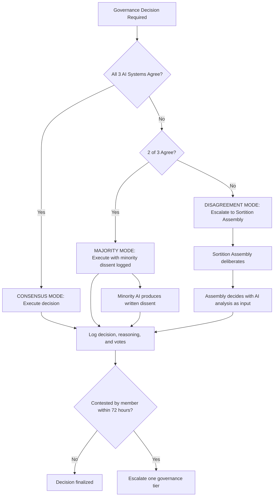
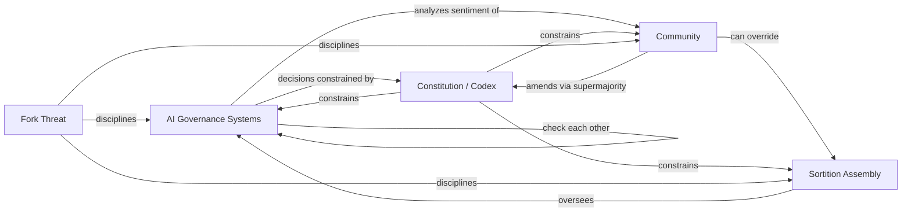
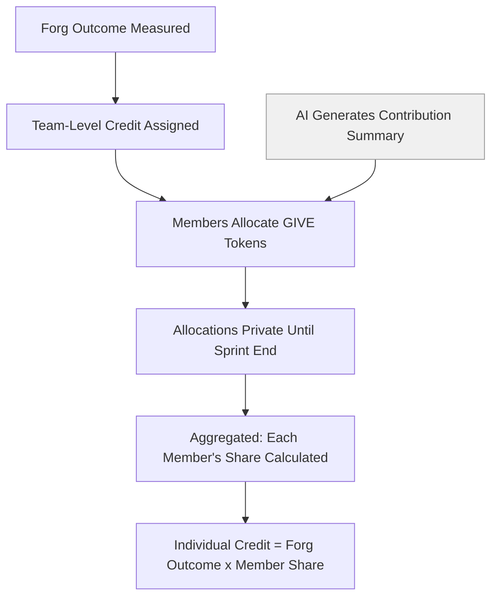

# Design Specification: AI Alignment & Non-Code Contributions

This document contains two interrelated specifications:

- **Part A:** Multi-Principal AI Alignment Framework (Task 1.3) -- how the Agent Commons governs itself when the governed have incompatible preferences and the governors are AI systems.
- **Part B:** Non-Code Contribution Framework (Task 1.5) -- how the Agent Commons values, measures, and rewards work that is not code-shaped.

These are interrelated because AI both governs the commons AND evaluates contributions. That dual role creates a separation-of-concerns problem addressed in the Integration section.

---

# Part A: Multi-Principal AI Alignment Framework

## A.1 The Multi-Principal Problem

Standard AI alignment assumes a single principal: one user, one set of preferences, one objective to maximize. Anthropic's Constitutional AI aligns Claude to a constitution authored by one organization. RLHF learns a reward model from a preference dataset curated by one team.

The Agent Commons has thousands of principals with legitimately competing interests. A Forg that builds developer tooling wants resources allocated to infrastructure. A Forg that builds client products wants resources allocated to business development. A new member wants low barriers to entry. A veteran member wants high standards for quality. A contributor in Lagos has different cost-of-living needs than a contributor in San Francisco.

**Arrow's impossibility theorem (1951) proves that no ranked-choice preference aggregation can simultaneously satisfy:**

1. **Unrestricted domain** -- works for any set of individual preferences
2. **Non-dictatorship** -- no single voter determines the outcome
3. **Pareto efficiency** -- if everyone prefers A to B, the group prefers A to B
4. **Independence of irrelevant alternatives (IIA)** -- the group's ranking of A vs. B does not depend on C

**Gibbard-Satterthwaite (1973) adds:** any non-dictatorial voting system with 3+ alternatives is susceptible to strategic manipulation.

**Mapping Social Choice Theory to RLHF (arXiv, 2024)** demonstrated that these impossibilities do not disappear when AI is used for preference aggregation -- RLHF's reward modeling fails "nearly all foundational axioms in social choice theory." The impossibilities relocate from the voting mechanism to the training process, reward function, and governance policy (ACM survey on impossibility results in AI, 2023).

The Agent Commons cannot escape these constraints. It must choose which desirable properties to sacrifice at each governance layer.

### A.1.1 The Layer-Specific Trade-off Configuration

Based on the research from [[01-AI-GOVERNANCE]], Section 1.5, the commons adopts different trade-off configurations at different governance layers:

| Layer | Sacrificed Property | Preserved Properties | Rationale |
|-------|-------------------|---------------------|-----------|
| **Layer 1: Constitutional** | Unrestricted domain | Non-dictatorship, Pareto, IIA | Some decisions are off-limits regardless of majority preference. The constitution constrains the option space. |
| **Layer 2: Governance** | Decisiveness | Non-dictatorship, Pareto, contestability | Contested decisions escalate rather than resolve by fiat. Slower governance is more legitimate governance. |
| **Layer 4: Economic** | Pareto optimality | Fairness, bounded extraction, non-dictatorship | The commons accepts some allocative inefficiency in exchange for equitable distribution. Not every beneficial trade will occur. |
| **Layer 6: Meta-governance** | Non-dictatorship | Stability, coherence, Pareto | The constitution has ultimate authority. It is a "dictator" in Arrow's sense -- but a dictator amendable only through supermajority democratic process. |

This configuration is not permanent. Every 3-5 years, the Constitutional Convention may re-ratify or modify which properties are sacrificed at each layer (see A.4). The trade-off choices themselves are subject to democratic review.

---

## A.2 Constitutional AI Extension for Organizations

### A.2.1 How Constitutional AI Works (Individual Alignment)

Anthropic's Constitutional AI (Bai et al., 2022) operates in two phases:

1. **Supervised learning phase:** The model generates self-critiques and revisions based on a written constitution.
2. **Reinforcement learning phase:** The model evaluates which outputs better comply with constitutional principles, using AI feedback (RLAIF) rather than exclusively human feedback.

Anthropic's January 2026 constitution establishes a priority hierarchy: (1) safety and human oversight, (2) ethical behavior, (3) Anthropic guidelines, (4) helpfulness. The Collective Constitutional AI (CCAI) experiment (Huang et al., ACM FAccT 2024) demonstrated that public priorities systematically differed from developer-written constitutions -- a critical finding confirming that single-author constitutions embed one set of values, not universal values.

### A.2.2 What Changes for Organizational Alignment

Extending Constitutional AI from individual assistant alignment to organizational governance requires four fundamental changes:

**Change 1: Multi-authored constitution.** The constitution is not written by a single development team. It is drafted by a sortition-selected constitutional convention of commons members, informed by AI analysis of trade-offs but decided by human deliberation. The constitution reflects a negotiated consensus among competing interests, not an idealized set of principles from one perspective. CCAI demonstrated this is feasible at 1,000-participant scale; the commons must implement it at full membership scale.

**Change 2: Competing interests are legitimate.** In individual alignment, conflicting user goals are treated as misalignment -- the AI should not help the user do contradictory things. In organizational alignment, conflicting member goals are the normal state. A Forg wanting more resources and a funding committee wanting fiscal prudence are both legitimate. The AI must balance competing interests, not resolve them toward a single objective. This requires the AI to represent multiple perspectives rather than converging on one.

**Change 3: The AI must balance, not maximize.** Individual CAI maximizes adherence to a priority-ordered constitution. Organizational CAI must balance multiple principles that genuinely conflict in specific cases. "Maximize contributor compensation" and "maintain the commons reserve fund" cannot both be maximized simultaneously. The AI must find Pareto-improving compromises and, when none exist, defer to the appropriate governance tier (see A.5).

**Change 4: The constitution evolves.** Anthropic can update Claude's constitution unilaterally. The commons constitution can only be amended through supermajority democratic process. The AI must track which version of the constitution applies to which decisions, maintain an amendment history, and recognize that principles adopted last month may override principles adopted last year.

### A.2.3 The Organizational Constitution

The following 15 principles constitute the initial commons constitution. They are ordered by priority -- when principles conflict, higher-numbered principles yield to lower-numbered ones. The initial text would be drafted and ratified by the founding constitutional convention; what follows is the proposed starting point based on the research evidence.

**Tier 1: Inviolable Constraints (the AI may NEVER override these regardless of majority preference)**

1. **No member may be expelled without due process.** Every contested decision has a contestation pathway. No governance action removes a member's right to voice, appeal, and exit with their accumulated contributions.

2. **No single entity -- human, AI, or coalition -- may hold unilateral governance authority.** Power must be distributed across at least three structurally independent governance mechanisms at all times. (Source: [[01-AI-GOVERNANCE]], Section 1.2; OpenAI governance crisis demonstrating single-entity failure.)

3. **Contribution data, reputation scores, and governance decisions must be transparent and auditable.** No secret governance. No hidden metrics. Every member can inspect the basis for any decision affecting them. (Source: Tyler's procedural justice framework -- transparency is a precondition for legitimacy.)

4. **Fork rights are unconditional.** Any group of members may fork the commons' open-source infrastructure and create a new commons. No governance action may restrict this right. Data and reputation are portable. (Source: [[02-IDENTITY-REPUTATION]], Section 2.4; open-source fork dynamics.)

5. **The concentration bounding mechanisms (quadratic weighting, time decay, contribution caps, UBR, monitoring) may not be weakened except by supermajority (75%) vote with a 6-month delay.** This constitutional protection prevents concentrated interests from dismantling their own constraints. (Source: [[SYNTHESIS]], Section 2.1, Chain 3.)

**Tier 2: Governance Principles (guide AI decision-making; may be balanced against each other)**

6. **Decisions should be made at the lowest governance tier capable of handling them.** Routine decisions stay at Tier 1 (AI Autonomous). Only genuinely contested or significant decisions escalate. Subsidiarity prevents both bottlenecks and illegitimate concentration of decision-making authority.

7. **Every member's voice has equal weight on constitutional questions, regardless of reputation, tenure, or contribution level.** One person, one vote on fundamental matters. Contribution-weighted influence applies only to operational and domain-specific decisions.

8. **The commons exists to serve its members, not to perpetuate itself.** If the commons no longer serves its members' interests, graceful dissolution and value distribution is preferable to institutional survival. No golden handcuffs.

9. **Economic returns must be proportional to contribution, bounded by floors and ceilings.** No member earns less than the universal basic allocation. No member's governance influence exceeds the logarithmic cap. Economic reward tracks contribution, subject to progressive bounding. (Source: [[CROSS-AREA-SYNTHESIS]], Section 3.1, Layer 4.)

10. **New members must be able to reach meaningful participation within 12 months.** The progressive initiation pathway may not become an exclusionary gate. Entry barriers must be competence-based, not social-capital-based.

**Tier 3: Operational Principles (inform AI analysis and recommendations)**

11. **Prefer reversible decisions over irreversible ones.** When outcomes are uncertain, choose the option that preserves future flexibility. Irreversible commitments require higher governance tier approval.

12. **When evidence is ambiguous, favor the interpretation that protects individual members over the interpretation that benefits the collective.** Individual rights are the default; collective claims require explicit justification.

13. **Maintain the economic reserve at a minimum of 6 months' operating costs.** Sustainability requires a buffer. This principle constrains spending decisions.

14. **AI governance systems must explain their reasoning in terms accessible to non-technical members.** Explanations need not reveal implementation details but must communicate the principles applied and the trade-offs considered.

15. **All governance roles rotate. No governance position may be held for more than 3 consecutive years without a mandatory gap year.** This prevents entrenchment and distributes the purpose-creating experience of governance broadly. (Source: [[04-LEGAL-SOCIAL]], Section 4.3.4, Mechanism 3.)

### A.2.4 The Role of Precedent

Should the AI follow its own prior decisions? The research points to a qualified yes:

- **Consistency matters for legitimacy.** Tyler's procedural justice framework identifies consistency as a component of perceived fairness. Members who see different treatment of similar cases will perceive the system as arbitrary.
- **But precedent must not prevent adaptation.** Rigid precedent produces the ossification that purpose-renewal mechanisms are designed to prevent.

**Design decision:** AI governance decisions create non-binding precedent. The AI should cite prior decisions on similar matters and explain any deviation. The Sortition Assembly may formally distinguish or override prior precedent. Constitutional Convention may reset all precedent. This balances consistency with adaptability.

---

## A.3 Plural AI Governance Specification

### A.3.1 Structural Independence Requirements

The commons must maintain a minimum of three AI governance providers meeting the following independence criteria:

| Criterion | Requirement | Rationale |
|-----------|-------------|-----------|
| **Training data** | Substantially different training corpora | Correlated training produces correlated failure modes and correlated biases |
| **Corporate ownership** | No two providers may share a majority owner or controlling shareholder | Economic incentives to collude must be structurally absent |
| **Geographical jurisdiction** | At least two different national jurisdictions | Government pressure on one provider cannot compromise the entire governance layer |
| **Architecture** | At least two fundamentally different model architectures | Same-architecture systems may share systematic blind spots |

**Current feasibility (2026):** Anthropic (US, transformer), Google DeepMind (US/UK, transformer/Gemini architecture), Mistral (France, transformer), and emerging Chinese providers (DeepSeek, Qwen) provide sufficient diversity. As the industry consolidates, maintaining this diversity becomes harder -- see A.3.5 on provider rotation.

### A.3.2 Operational Modes

**Consensus mode (all 3 agree):** The decision executes automatically. All three AI systems' reasoning is logged. The decision is contestable by any member within 72 hours.

**Majority mode (2 of 3 agree):** The decision executes. The minority AI produces a written dissent explaining its reasoning. The dissent is published alongside the decision. Any member may escalate to the Sortition Assembly within 72 hours, citing the minority dissent as grounds. If not escalated, the decision stands.

**Disagreement mode (no majority):** The decision is automatically escalated to the Sortition Assembly. All three AI systems present their analysis and recommendations. The Assembly deliberates and decides. The AI systems do not vote in the Assembly; they advise.

**Confidence thresholds for self-escalation:** Any AI system may unilaterally escalate a decision it would otherwise participate in if its confidence is below 60%. This implements Russell's uncertainty principle -- a governance AI uncertain about the right answer should defer to human judgment rather than guess (Russell, 2019, "Human Compatible").

### A.3.3 The GaaS Enforcement Layer

The Governance-as-a-Service layer operates independently of the three AI governance providers. It is a runtime constraint-checking system, not a decision-making system. Its architecture follows the GaaS framework tested with LLaMA3, Qwen3, and DeepSeek-R1 (arXiv, 2025).

**What it does:**

1. **Constitutional constraint checking:** Every AI governance decision is checked against the 15 constitutional principles before execution. Decisions that violate Tier 1 (inviolable) principles are blocked automatically. Decisions that tension Tier 2 or 3 principles are flagged with an explanation.

2. **Consistency verification:** Compares each decision against the precedent database. Flags inconsistencies exceeding a configurable threshold. Does not block -- flags for human review.

3. **Concentration monitoring:** Continuously computes Nakamoto coefficient, Gini coefficient for reputation and governance participation, and minimal quorum size. Triggers automatic alerts when thresholds are breached (see Section A.4.1).

4. **Audit trail:** Every governance decision is logged with: the decision, all three AI systems' recommendations, the GaaS constraint check results, the final disposition, and any contestation or escalation history. Logs are immutable and publicly accessible.

5. **Automatic escalation triggers:** The GaaS layer escalates decisions when:
   - Any Tier 1 constitutional principle is at risk
   - The Nakamoto coefficient drops below the alert threshold
   - More than 15% of decisions in a 30-day window are contested
   - A pattern of systematic bias is detected across multiple decisions

**What the GaaS layer cannot do:**

- It cannot make governance decisions. It can only check, flag, and block.
- It cannot be overridden by any single AI provider. Override requires Sortition Assembly approval.
- It cannot modify its own constraint rules. Rule changes require constitutional amendment process (75% supermajority + 6-month delay).

### A.3.4 Adversarial Dynamics

The three AI systems must actually check each other, not merely agree. Left unchecked, AI systems trained on similar data with similar objectives will converge toward similar outputs -- producing the appearance of independent verification without the substance.

**Ensuring genuine adversarial checking:**

1. **Structured devil's advocacy.** For every Tier 2+ decision, at least one AI system is randomly assigned the "adversarial" role -- required to produce the strongest possible argument against the majority position. This is rotated so no single provider is permanently adversarial. (Source: [[01-AI-GOVERNANCE]], Section 1.2 -- "adversarial AI as productive force.")

2. **Divergence scoring.** The GaaS layer tracks the correlation between AI systems' decisions. If any two systems agree more than 85% of the time over a 90-day window, an automatic review is triggered to determine whether the correlation reflects genuine agreement or correlated failure. The expected baseline for independent systems on contested governance questions is 60-75% agreement.

3. **Periodic adversarial testing.** Quarterly, a dedicated red team submits governance scenarios designed to test whether the AI systems are independently evaluating or herding. Red team scenarios include: edge cases where constitutional principles conflict, novel situations with no precedent, and deliberately ambiguous cases where reasonable disagreement is expected. If all three AI systems give identical responses to ambiguous cases, independence has failed.

4. **Training divergence audits.** Annually, the commons commissions an independent audit of the three AI providers' training processes to verify that meaningful differences in training data, RLHF methodology, and constitutional interpretation persist. If providers converge in training approach, the commons must find a replacement provider.

### A.3.5 What Happens When Providers Fail

**One provider compromised (security breach, corporate capture, or systematic bias discovered):**
- Immediately switch to 2-provider mode with mandatory unanimity for all Tier 1 and 2 decisions.
- Sortition Assembly activates replacement search. Replacement must be operational within 90 days.
- GaaS layer lowers the threshold for automatic escalation to human governance during the transition.

**Two providers compromised:**
- Constitutional failsafe activates: all AI governance decisions are suspended.
- Sortition Assembly assumes full decision-making authority for the duration.
- Community Referendum is triggered to approve emergency governance measures.
- The GaaS layer continues operating as a constraint checker on human decisions (constitutional compliance verification does not require AI governance providers).

**Provider rotation:** No AI provider may serve continuously for more than 5 years. At least one provider must be rotated every 2 years. This prevents lock-in, maintains market discipline, and forces the commons to maintain provider-independent governance infrastructure. The replacement process is managed by the Sortition Assembly, with community ratification for each new provider.

---

## A.4 The Recursive Governance Solution

### A.4.1 The Circles of Mutual Constraint

The research found that recursive governance -- who governs the governors? -- cannot be solved with a terminal answer. It can only be managed through circular mutual constraint where no single node holds final authority ([[SYNTHESIS]], Section 5.3; [[01-AI-GOVERNANCE]], Section P1 Assessment).

**Circle 1: Horizontal AI checking.** The three AI systems check each other through the consensus/majority/disagreement mode and structured adversarial advocacy. No single AI system can act unilaterally on any governance decision.

**Circle 2: Vertical human oversight.** The Sortition Assembly checks AI governance by reviewing escalated decisions, conducting quarterly performance reviews of AI governance quality, and retaining override authority on any AI decision.

**Circle 3: Democratic legitimacy.** The Community can override the Sortition Assembly through referendum (triggered by 10% member petition). This prevents the Assembly from becoming an entrenched governance class.

**Circle 4: AI analysis of community.** AI systems analyze community sentiment, participation patterns, and satisfaction metrics to surface emerging concerns before they become crises. This closes the loop -- AI serves the community that oversees the AI.

**Circle 5: Constitutional constraint.** The Constitution constrains all nodes -- AI, Assembly, and Community. Even a unanimous community vote cannot override Tier 1 inviolable principles without the full constitutional amendment process (75% supermajority + 6-month delay + cross-layer approval).

**Circle 6: External discipline.** The fork threat provides discipline from outside the governance circle. If governance becomes captured, members can exit with their contributions and reputation. This threat constrains all internal governance actors because capture triggers exit, which destroys the commons' value.

### A.4.2 What Prevents the Circle from Breaking?

Each node has an independent power base that the other nodes cannot unilaterally destroy:

| Node | Independent Power Base | What Protects It |
|------|----------------------|-----------------|
| AI Systems | Technical infrastructure, trained models, operational autonomy for Tier 1 decisions | Multiple independent providers; no single entity controls all three |
| Sortition Assembly | Random selection from membership; compensation for service; constitutional authority | Cannot be "voted out" (not elected); terms are fixed; membership drawn from all members |
| Community | Numbers; referendum power; fork right | Fork right cannot be revoked; referendum threshold (10%) is deliberately low |
| Constitution | Supermajority amendment requirement; 6-month delay | High bar for change means it persists even when individual actors want to change it |
| Fork Threat | Portable data and reputation; open-source infrastructure | Unconditional exit right is Tier 1 constitutional principle |

**No single node can dominate two others.** AI cannot override the Assembly or the Community. The Assembly cannot override the Community or alter the Constitution alone. The Community cannot alter Tier 1 principles without supermajority + delay. Each node constrains and is constrained.

### A.4.3 Failure Modes and Monitoring

| Failure Mode | Detection Method | Response |
|-------------|-----------------|----------|
| AI systems converge (lose independence) | Divergence scoring drops below 60% agreement/disagreement ratio | Trigger provider audit; if confirmed, replace one provider within 90 days |
| Sortition Assembly captured by faction | Track voting patterns for bloc behavior; monitor member complaints | If bloc detected, increase Assembly size and rotation frequency; trigger special Community Referendum |
| Community apathy (low participation) | Monitor referendum turnout, contestation rates, governance role acceptance rates | If turnout drops below 15%, activate engagement incentives; expand governance compensation; lower escalation thresholds |
| Constitutional ossification | Track time since last amendment; monitor member satisfaction with governance rules | If no amendments in 5+ years despite changing conditions, trigger mandatory Constitutional Convention |
| Fork threat loses credibility | Monitor data/reputation portability; test fork feasibility annually | If forking becomes technically difficult, prioritize portability infrastructure |
| GaaS layer captured or degraded | Annual independent audit; red team testing of constraint enforcement | If audit fails, rebuild GaaS layer with new implementation; Sortition Assembly oversees |

---

## A.5 AI Decision-Making Specification

### A.5.1 Tier 1: AI Autonomous (~70% of decisions)

**Decision types:**
- Routine Forg coordination (task matching, schedule coordination, resource access within established budgets)
- Contribution tracking and reputation score updates
- Standard quality review of submitted work
- Conflict-of-interest flagging
- Routine membership status updates (phase progression in initiation pathway)
- Standard economic distributions according to established formulas

**Parameters:**
- Maximum economic impact per decision: 2% of monthly commons budget
- No decisions affecting member status, rights, or governance participation
- All three AI systems must be in consensus mode or majority mode
- Confidence threshold: 75% (below this, self-escalate to Tier 2)

**Response time:** Within 4 hours for standard decisions; within 1 hour for time-sensitive operational decisions.

**Logging requirements:** Decision recorded with: reasoning summary, constitutional principles applied, affected members notified, 72-hour contestation window opened.

### A.5.2 Tier 2: AI Proposes, Human Confirms (~20% of decisions)

**Decision types:**
- New Forg formation or dissolution approval
- Budget allocation above 2% of monthly commons budget
- Dispute resolution between Forgs
- Reputation adjustment outside standard formulas (e.g., recognizing exceptional invisible contributions)
- Policy proposals within existing constitutional framework
- Membership phase advancement where competence is ambiguous

**Escalation triggers (from Tier 1):**
- Any member contests a Tier 1 decision within 72 hours
- AI confidence below 75%
- Decision affects more than 10% of active members
- Economic impact exceeds 2% of monthly budget
- Decision creates precedent on an issue with no prior governance history

**Confirmation process:**
1. AI systems produce a joint recommendation with majority and minority positions.
2. A randomly selected committee of 5 members reviews the recommendation. Committee members are drawn from a pool of members who have completed contributor-phase initiation and have no conflict of interest.
3. The committee has 7 calendar days to approve, modify, or reject.
4. If the committee does not respond within 7 days, the decision is auto-approved if all three AI systems were in consensus mode. Otherwise, it escalates to Tier 3.

**Time limit and default:** 7 calendar days. Default if no response: auto-approve for consensus decisions; escalate for non-consensus decisions.

### A.5.3 Tier 3: Human Deliberation (~8% of decisions)

**Decision types:**
- Resource allocation disputes involving more than 2 Forgs
- Appeals of Tier 2 decisions
- Interpretation of constitutional principles in novel situations
- Modification of operational parameters (take rate adjustments, reputation decay rate changes, contribution cap levels)
- Forg dissolution appeals
- Precedent-setting decisions that will affect future governance

**When triggered:**
- Tier 2 committee escalation
- 5% of active members petition for Tier 3 review
- AI self-escalation due to constitutional principle tension
- GaaS layer flags potential constitutional issue

**Assembly composition:** The full Sortition Assembly (15-25 members on 6-month staggered terms) deliberates. For domain-specific questions, the Assembly may invite subject-matter experts (non-voting advisors).

**Deliberation process:**
1. AI systems provide balanced briefing materials presenting multiple perspectives.
2. Affected parties present their positions (voice, per Tyler's procedural justice).
3. Assembly deliberates for a minimum of 48 hours (no snap decisions).
4. Assembly votes by simple majority. Dissenting opinions are published.
5. Decision is final unless escalated to Tier 4 by 10% member petition within 14 days.

**Timeline:** Maximum 30 calendar days from trigger to decision.

**AI advisory role:** AI systems provide analysis, model scenarios, and synthesize relevant precedent. AI systems do not vote. AI systems must present arguments for and against each option, not advocate for a single recommendation.

### A.5.4 Tier 4: Community Referendum (~2% of decisions)

**Decision types:**
- Constitutional amendments
- Governance AI provider replacement
- Trade-off configuration changes (Section A.1.1)
- Fundamental economic model changes (take rate structure, distribution formula)
- Commons dissolution or merger
- Any decision escalated by 10% member petition

**When triggered:**
- Constitutional amendment proposal (from Assembly or 10% petition)
- Scheduled periodic re-ratification (every 3-5 years per sunset clause)
- 10% member petition on any Tier 3 decision

**Quorum requirements:** 40% of active members must participate for the referendum to be valid. "Active members" means members who have logged at least one contribution or governance action in the preceding 90 days.

**Supermajority thresholds:**
- Constitutional amendments: 75% approval
- Governance AI provider replacement: 60% approval
- Trade-off configuration changes: 67% approval
- Other Tier 4 decisions: simple majority (50% + 1)

**Campaign period:** Minimum 30 calendar days between proposal publication and vote. During this period:
- AI systems produce balanced analysis of the proposal's implications
- Proponents and opponents may publish position statements
- At least one structured deliberation session (virtual or physical) must be held
- AI systems may NOT advocate for a position; they must present balanced analysis only

**AI neutrality requirements:** During Tier 4 campaigns, the GaaS layer monitors AI system outputs for bias toward any position. If bias is detected, the biased AI system is suspended from advisory functions for the remainder of the campaign. The remaining two AI systems continue providing analysis.

---

# Part B: Non-Code Contribution Framework

## B.1 The Contribution Taxonomy

Git tracks code with forensic precision. Nothing comparable exists for the contributions that matter most in an AI-augmented organization. The research identified this as Gap #4 in the commons design ([[CROSS-AREA-SYNTHESIS]], Section 4.3): the system risks systematically undervaluing its most important inputs.

### B.1.1 Contribution Types

| Type | What Makes It Valuable | Why It Is Hard to Measure | Proxy Signals |
|------|----------------------|--------------------------|---------------|
| **Design** (visual, UX, system architecture) | Shapes user experience and system coherence; prevents costly rework | Quality is subjective; the best design is invisible (users do not notice it) | Peer review scores; adoption rates; rework reduction; user satisfaction |
| **Strategy** (direction-setting, opportunity identification) | Determines what the commons builds; avoids wasted effort | Impact is long-delayed and counterfactual ("what did NOT happen because of this insight?") | Prediction market accuracy; project outcome correlation; peer assessment |
| **Mentoring and teaching** | Multiplies other members' effectiveness; transmits institutional knowledge; creates purpose (Frankl's creative values) | The mentor's contribution shows up in the mentee's output, not the mentor's | Mentee progression rate; mentee satisfaction; teaching evaluation scores |
| **Community building** (onboarding, conflict resolution, culture) | Creates the social infrastructure that makes everything else possible; provides Jahoda's social contact function | Invisible work (Star & Strauss, 1999) -- seen only in its absence | New member retention rate; conflict resolution speed; community satisfaction surveys |
| **Relationship management** (partnerships, outreach) | Brings in external resources, clients, and collaborators | Results are lumpy (one relationship may produce zero or enormous value) | Partnership outcomes; revenue from partnerships; network expansion |
| **Governance participation** (serving on assemblies, voting, contesting) | Legitimizes the system; creates meaning (Tocqueville's thesis); prevents capture | Participation is its own reward per Tocqueville, but unrewarded participation declines | Participation rates; decision quality metrics; governance satisfaction scores |
| **Quality assurance** (review, testing, feedback) | Prevents defective output from reaching users; maintains commons reputation | QA catches problems that did not happen -- measuring the absence of failure | Defect escape rate; review thoroughness scores; contributor satisfaction with review |
| **Knowledge creation** (documentation, research, synthesis) | Creates shared understanding; reduces duplicated effort; enables onboarding | Often treated as overhead rather than core contribution | Documentation usage metrics; knowledge reuse rates; onboarding time reduction |

### B.1.2 The Invisible Work Problem

Star and Strauss (1999) established that visibility is political: "No work is inherently either visible or invisible. We always 'see' work through a selection of indicators." The indicators a system chooses to track determine which contributions are valued.

Three categories of invisible work are particularly critical for the commons:

- **Articulation work:** Coordinating, scheduling, making things fit together. The person who ensures the Forg's work integrates smoothly contributes enormous value that appears nowhere in any artifact.
- **Emotional labor:** Creating psychological safety, managing interpersonal tensions, maintaining team morale. The person who prevents a team conflict contributes more than the person who resolves one, but only the resolver's work is visible.
- **Background maintenance:** Keeping systems running, updating documentation, onboarding newcomers. The infrastructure that "just works" represents continuous invisible effort.

**Design principle:** The contribution framework must create explicit categories for invisible work with protected allocation. Failing to do so reproduces the exact bias that traditional organizations have -- overvaluing visible, individual, artifact-producing work and undervaluing invisible, collective, infrastructure-maintaining work.

---

## B.2 The Three-Signal Attribution System

No single measurement can capture the full value of diverse contributions. The framework combines three complementary signals, each with different strengths and vulnerabilities.

### B.2.1 Signal 1: Team-Outcome Attribution (Buurtzorg Model)

**How it works:**

Forgs (3-12 person teams) have measurable outcomes: project completion, quality scores, client satisfaction, adoption metrics. The primary unit of attribution is the Forg as a whole, not the individual.

Within the Forg, members distribute credit to each other using a Coordinape-style GIVE token system. Each member receives 100 GIVE tokens per sprint and allocates them to teammates based on perceived contribution. The allocation is private until the sprint ends, preventing strategic coordination.

**Why this works:**

- **Small-group social knowledge.** In a team of 5-12 people, everyone knows who contributed what. Peer assessment accuracy at Dunbar scale is far higher than at organizational scale (APA meta-analysis: peer interrater reliability of .37, higher than supervisors' .50 for some contribution types).
- **Dissolves the individual measurement problem.** Rather than trying to attribute team output to individuals through external observation, the system leverages the information that teammates already have.
- **Gaming resistance:** Limited by Forg size and direct observation. Gaming GIVE tokens requires convincing 4-11 teammates who directly observed your contributions -- far harder than gaming an automated metric.

**Documented problems and mitigations:**

| Problem | Source | Mitigation |
|---------|--------|------------|
| Founders receive more tokens than warranted (status bias) | RnDAO, 2025; Coordinape | No permanent "founder" status within Forgs; rotation of Forg leadership roles |
| Members forget to track contributions throughout sprint | Coordinape documentation | AI-generated contribution summaries provided to each member at sprint end, before GIVE allocation |
| Reciprocity bias ("I give to you because you gave to me last time") | 360-degree feedback research (APA, 2012) | GIVE allocations are private until sprint ends; allocation history is not visible to recipients until aggregation |

### B.2.2 Signal 2: AI Quality Assessment

**How it works:**

AI systems evaluate contribution artifacts across multiple dimensions using rubrics calibrated to each contribution type. The AI assessment is a supplementary signal, not a primary metric -- it catches contributions that peer assessment might miss (especially invisible work) and provides a consistency check.

**Evaluation rubrics by contribution type:**

| Contribution Type | AI-Assessable Dimensions | Not AI-Assessable |
|-------------------|-------------------------|-------------------|
| **Code** | Complexity, test coverage, documentation quality, bug density, review responsiveness | Architectural vision, mentoring impact during development |
| **Design** | Consistency with design system, accessibility compliance, user flow completeness | Aesthetic judgment, brand coherence, user emotional response |
| **Documentation** | Completeness, accuracy, readability score, coverage of edge cases | Whether it answers the questions newcomers actually have |
| **Strategy** | Logical coherence, evidence citation, risk identification, stakeholder coverage | Whether the strategic insight is genuinely novel or merely well-articulated |
| **Community building** | Onboarding completion rates, conflict resolution time, new member retention | Quality of relationships, psychological safety created, cultural tone |
| **Governance participation** | Decision quality (outcome tracking), participation consistency, deliberation thoroughness | Wisdom of judgment calls, courage to dissent, fairness of approach |

**Calibration:** AI quality assessments are calibrated quarterly against a panel of 10 human expert assessors who independently evaluate a random sample of 50 contributions across all types. The AI assessment is adjusted to match the distribution of human expert judgments. If AI and human assessments diverge by more than 1 standard deviation on any contribution type, the AI rubric for that type is revised.

**Limits and privacy:**

- The AI can assess observable artifacts (code, documents, designs, governance decisions) but cannot assess invisible work (emotional labor, informal mentoring, relationship building) directly.
- The AI does NOT monitor real-time communication channels (Slack, video calls). It assesses submitted artifacts only.
- Members may opt out of AI quality assessment for any specific contribution, accepting that the contribution will rely solely on Signals 1 and 3 for attribution.

### B.2.3 Signal 3: Market/Community Signals

**How it works:**

Three sub-signals capture how the broader community values contributions:

1. **Quadratic Funding votes.** Members allocate QF tokens to projects and contributors they value. QF's mathematical properties (matching formula weights number of supporters over amount) prevent plutocratic distortion. This captures "revealed preference" -- what the community actually values enough to spend tokens on. (Source: Gitcoin's $67M+ QF experiment; Buterin/Hitzig/Weyl, 2019.)

2. **Usage metrics.** For contributions that produce outputs (tools, documentation, designs, frameworks), usage metrics provide demand signals: downloads, adoption rates, integration into other projects, citation in governance decisions.

3. **Peer endorsements.** Members can endorse specific contributions with a brief rationale. Endorsements are weighted by the endorser's reputation in the relevant domain (a governance expert's endorsement of a governance contribution carries more weight than a developer's endorsement of the same). This captures qualitative judgment that QF and usage metrics miss.

**Time-weighting:** Recent signals carry more weight than historical ones. A contribution endorsed heavily 6 months ago but unused today receives less ongoing credit than a contribution steadily used over the same period. Decay rate: 25% per quarter for endorsements; 15% per quarter for usage metrics; QF allocations are per-epoch and do not decay.

---

## B.3 Combining Signals

### B.3.1 Weight Allocation

Starting weights (subject to empirical calibration during the pilot):

| Signal | Weight | Rationale |
|--------|--------|-----------|
| Signal 1: Team-Outcome Attribution | 50% | Primary signal; leverages small-group social knowledge; most gaming-resistant |
| Signal 2: AI Quality Assessment | 20% | Supplementary; catches invisible work; provides consistency; but least proven |
| Signal 3: Market/Community Signals | 30% | Captures broader community value; provides demand signal; but most gameable |

### B.3.2 Weight Adjustment by Contribution Type

Different contribution types require different signal weights because the signals have different validity for different work:

| Contribution Type | Signal 1 Weight | Signal 2 Weight | Signal 3 Weight |
|-------------------|----------------|-----------------|-----------------|
| Code | 40% | 30% | 30% |
| Design | 45% | 25% | 30% |
| Strategy | 55% | 10% | 35% |
| Mentoring | 60% | 10% | 30% |
| Community building | 60% | 5% | 35% |
| Governance participation | 50% | 15% | 35% |
| Quality assurance | 40% | 35% | 25% |
| Knowledge creation | 35% | 30% | 35% |

**Principle:** The harder a contribution type is to assess externally, the more weight shifts to Signal 1 (team-based peer assessment) where direct observation is strongest. The more artifact-oriented a contribution type, the more weight shifts to Signal 2 (AI quality assessment) where automated evaluation is most reliable.

### B.3.3 Conflict Resolution When Signals Disagree

When signals produce substantially different valuations for the same contribution (more than 1 standard deviation apart), the system applies the following resolution:

1. **Signal 1 high, Signals 2-3 low:** The team values the contribution but the broader community and AI do not. Most common for invisible work and team-specific context. **Resolution:** Accept the Signal 1 valuation. The team has information the other signals lack. Flag for AI calibration review -- the AI rubric may be missing this contribution type.

2. **Signal 2 high, Signals 1 and 3 low:** The AI identifies quality that peers and community missed. Most common for technically excellent but unglamorous work (refactoring, documentation, test coverage). **Resolution:** Weight the AI assessment up to 40% for this specific evaluation. Notify the Forg that the AI identified an under-recognized contribution.

3. **Signal 3 high, Signals 1-2 low:** The community values the contribution but the team and AI do not. Most common for popular but low-quality work, or for contributions whose value is to the broader community rather than the Forg. **Resolution:** Investigate. If the contribution genuinely serves the broader community (cross-Forg infrastructure, public documentation), credit is appropriate. If the signal reflects popularity gaming, reduce Signal 3 weight for this contributor for the current epoch.

4. **All three signals disagree significantly:** Escalate to Tier 2 governance for human review. This should be rare (<5% of evaluations).

### B.3.4 The Invisible Work Problem: Protected Allocation

The research is unambiguous: the highest-value contributions in an AI-augmented organization are precisely those that resist quantification (Star & Strauss, 1999; [[02-IDENTITY-REPUTATION]], Section 2.2; [[CROSS-AREA-SYNTHESIS]], Section 4.3). No signal combination will fully capture mentoring quality, community trust, or psychological safety created.

**Solution: Governance-recognized contribution categories with protected allocation.**

The commons reserves 15% of its total attribution budget for "invisible work categories" that are allocated through governance rather than signal aggregation:

| Protected Category | Allocation Method | Budget Share |
|-------------------|-------------------|-------------|
| Mentoring and teaching | Mentee assessment (after 3-month delay to prevent gaming) | 5% |
| Community maintenance | Quarterly community satisfaction survey; correlation with named individuals | 4% |
| Governance service | Fixed compensation per governance role (Assembly member, committee member, red team) | 4% |
| Cross-Forg coordination | Inter-Forg peer assessment by Forg leads | 2% |

The protected allocation is NOT a bonus on top of signal-based attribution. It is funded by reducing the signal-based budget proportionally. This ensures invisible work is valued at the expense of visible work's share, not as an afterthought.

---

## B.4 Anti-Gaming Design

### B.4.1 Gaming Vectors for Each Signal

| Signal | Gaming Method | Difficulty | Countermeasure |
|--------|-------------|------------|----------------|
| **Signal 1** | Collusion within Forg (mutual over-allocation) | Moderate (requires coordinating 5-12 people) | Cross-Forg comparison: if one Forg consistently self-rates above outcome-adjusted expectations, flag for review |
| **Signal 1** | Social pressure (punishing low allocators) | Low (natural social dynamic) | Private allocation until sprint end; no individual allocation history visible |
| **Signal 2** | Optimizing artifacts for AI rubric rather than actual quality | Moderate (requires understanding rubric) | Rotate rubric dimensions quarterly; AI evaluators retrained on updated criteria; human calibration panel catches rubric-optimized-but-low-quality work |
| **Signal 2** | Using AI to generate impressive-looking but low-value contributions | High (AI-generated contributions becoming indistinguishable) | AI-powered anomaly detection of contribution patterns; behavioral analysis over time; peer assessment (Signal 1) catches low-value contributions |
| **Signal 3** | QF Sybil attacks (splitting identity to amplify small contributions) | Depends on Sybil resistance layer | QF depends on P2 (Sybil resistance); Gitcoin Passport / Human Passport threshold required for QF participation |
| **Signal 3** | Endorsement rings (mutual endorsement cartels) | Moderate | Graph analysis of endorsement patterns; flag cliques; weight endorsements by endorser's domain reputation |
| **Signal 3** | Popularity optimization (producing flashy but low-quality work) | Low | AI quality assessment (Signal 2) and team assessment (Signal 1) counterbalance popularity signal |

### B.4.2 The Goodhart Cascade

Goodhart's Law (1975): "When a measure becomes a target, it ceases to be a good measure." Campbell's Law extends: "The more any quantitative social indicator is used for social decision-making, the more subject it will be to corruption pressures."

The Goodhart Cascade operates recursively:

1. Measure contributions -> contributions are gamed to match the measure
2. Measure gaming detection -> gaming evolves to evade detection
3. Measure detection evolution -> meta-gaming emerges
4. At each level, the system is measuring its own measurement, not the underlying reality

**The multi-signal defense:** Gaming one signal is easy. Gaming all three signals simultaneously -- convincing your team, the AI, and the broader community that a low-value contribution is high-value -- is qualitatively harder. The signals are constructed to be independent: Signal 1 uses direct human observation, Signal 2 uses automated artifact analysis, Signal 3 uses revealed community preferences. An attacker who optimizes for one signal (e.g., producing AI-rubric-perfect artifacts) will likely underperform on another (e.g., peer assessment, because teammates observed the actual work process).

**Dynamic weight adjustment:** If gaming is detected in one signal (through anomaly detection, red team discovery, or statistical analysis), the system automatically reduces that signal's weight for the affected contributor, contribution type, or epoch, and redistributes to the other signals. This creates a moving target that gaming strategies cannot permanently exploit.

### B.4.3 Adversarial Red Team

The commons maintains a permanent red team (3-5 members, rotated annually) whose explicit mandate is to game the contribution system. Red team members:

- Attempt to inflate their own attribution scores through every gaming strategy they can devise
- Report all successful strategies to the Sortition Assembly
- Each successful gaming strategy triggers a mechanism adjustment
- Red team members are compensated at the median contributor rate regardless of their attribution scores (so they have no incentive to conceal successful strategies)
- Red team reports are published (anonymized) quarterly to build community gaming awareness

### B.4.4 Graceful Degradation

The system must function acceptably even with 5-15% gaming. Zero gaming is impossible; the question is the tolerance threshold.

**Design for 15% gaming tolerance:**
- No single signal controls more than 50% of attribution
- No single member can affect more than 5% of any Forg's total attribution through their GIVE allocation
- QF matching is capped per contributor per epoch to limit Sybil impact
- Attribution scores are normalized within contribution type, so gamers in one type do not distort attribution in others

---

## B.5 The Shapley Value Approximation

### B.5.1 Theoretical Ideal

The Shapley value (Shapley, 1953) provides the mathematically unique fair allocation satisfying efficiency, symmetry, dummy player, and additivity axioms. For team contribution attribution, it answers: "What is each person's average marginal contribution across all possible coalitions?"

This is the theoretical gold standard because it accounts for complementarities (Alice's design enabled Bob's implementation) and counterfactuals (what would have happened without Carol?).

### B.5.2 Computational Reality

Exact Shapley value computation requires evaluating 2^n coalitions. For a 12-person Forg, that is 4,096 coalitions. For a cross-Forg attribution involving 50 people, it is over 10^15. Exact computation is NP-hard and practically infeasible for all but the smallest teams.

### B.5.3 AI-Assisted Approximation

The proposed approximation uses AI to estimate marginal contributions based on three inputs:

1. **Contribution history.** What the person has done -- artifacts produced, reviews conducted, meetings attended, decisions made. The AI reconstructs a timeline of contributions.

2. **Counterfactual analysis.** The AI estimates what would have happened without this person's specific contributions. "If Alice had not produced the architectural design, how much longer would the project have taken? Who would have done an equivalent design, and at what quality?" This is inherently speculative, but AI can model plausible counterfactuals better than unaided human judgment.

3. **Peer assessment.** How teammates rate this person's irreplaceability on a 1-10 scale: "How much worse would the project outcome have been without this person?"

**Combining inputs:** The AI produces a Shapley estimate by weighting counterfactual analysis (50%), contribution history (30%), and peer irreplaceability assessment (20%). The estimate is presented as a range, not a point value, reflecting epistemic uncertainty.

### B.5.4 When to Use

Shapley estimation is computationally expensive and should be reserved for high-stakes attribution decisions:

- Distribution of revenue from a major project (>$50K)
- Reputation milestone decisions (promotion to Steward phase)
- Dispute resolution when Signal 1-3 produce contested results
- Annual contributor recognition awards

Shapley estimation is NOT used for routine sprint-level attribution (the three-signal system handles this).

### B.5.5 Calibration

Shapley estimates should correlate with peer allocation (Signal 1). If the Shapley estimate for a contribution is 2x higher than the peer allocation, it suggests peers undervalued the contribution (common for invisible work). If the Shapley estimate is 2x lower, it suggests peers overvalued the contribution (common for high-status members). Persistent divergence in one direction indicates a systematic bias in peer allocation that should be addressed through the protected allocation mechanism (Section B.3.4).

---

# Integration: How the Two Frameworks Connect

## The Dual Role Problem

AI both governs the commons (Part A) AND evaluates contributions (Part B, Signal 2). This creates a separation-of-concerns tension: the entity that decides how resources are allocated also assesses who deserves them. In traditional organizations, this is analogous to a manager who both sets targets and evaluates performance -- a known conflict of interest.

### Design for Separation

**Different AI instances for governance and evaluation.** The three AI systems used for governance decisions (Part A) are NOT the same AI instances used for contribution quality assessment (Part B, Signal 2). The evaluation AI operates on different infrastructure, with different access controls, and is subject to different calibration procedures.

**No feedback loop from evaluation to governance weighting.** An AI system's contribution evaluation does not influence how that AI system's governance recommendations are weighted. If AI System A assesses that Forg X's contributions are high quality, this does not increase AI System A's influence over decisions affecting Forg X.

**Human arbitration for conflicts.** When a governance decision and a contribution evaluation involve the same member or Forg, and the decisions are linked (e.g., resource allocation based partly on contribution quality), a Sortition Assembly subcommittee reviews for conflicts. The subcommittee can adjust either the governance decision or the contribution evaluation, or both.

## How the AI Alignment Framework Uses Contribution Data

Governance decisions frequently depend on knowing who contributed what:

- **Resource allocation:** The governance AI must understand which Forgs are productive (contribution data) to allocate resources wisely.
- **Dispute resolution:** Disputes about credit require contribution history.
- **Membership advancement:** Progression through the initiation pathway requires assessed contribution quality.

The governance AI accesses contribution data in aggregated form: Forg-level outcomes, anonymized distribution patterns, trend data. It does NOT access individual GIVE token allocations, individual AI quality scores, or individual peer endorsements. Aggregation prevents the governance AI from developing biases toward or against specific individuals based on granular evaluation data.

## How the Contribution Framework Depends on AI Governance

- **Signal 2 (AI quality assessment)** is part of the governance infrastructure. The calibration, auditing, and oversight of evaluation AI falls under the governance framework's quality assurance processes.
- **Protected allocation** for invisible work categories is a governance decision reviewed annually by the Sortition Assembly.
- **Anti-gaming responses** (weight adjustment, red team actions, mechanism modifications) are governance actions subject to the escalation ladder.

## Connection to the Economic Model (Layer 4)

The contribution framework feeds directly into the economic model:

- **Attribution scores** determine each member's share of patronage distributions.
- **Signal weights** are economic parameters governed by the Sortition Assembly.
- **Protected allocation** for invisible work is funded from the commons' operating budget, approved through Tier 2 governance.
- **Shapley value estimates** inform high-stakes economic distributions.

The economic model specification (a separate design document) must define how attribution scores translate to economic value -- the exchange rate between "contribution credit" and "economic return." This specification establishes the attribution system; the economic specification establishes the distribution system.

---

## Summary: Key Design Decisions

### Part A: Multi-Principal AI Alignment

| Decision | Specification | Source |
|----------|--------------|--------|
| Impossibility trade-offs | Layer-specific; Constitutional sacrifices domain, Governance sacrifices decisiveness, Economic sacrifices Pareto, Meta sacrifices non-dictatorship | Arrow (1951); [[01-AI-GOVERNANCE]], Sec 1.5 |
| Constitutional principles | 15 principles in 3 tiers; Tier 1 inviolable; Tier 2 balanceable; Tier 3 operational | Research synthesis; Tyler procedural justice |
| AI provider count | Minimum 3, structurally independent | [[01-AI-GOVERNANCE]], Sec 1.2; collusion research |
| Operational modes | Consensus / Majority+Dissent / Disagreement+Escalation | Blockchain oracle consensus pattern |
| GaaS enforcement | Independent runtime layer; cannot be overridden by single provider | arXiv GaaS framework (2025) |
| Recursive governance | Circular mutual constraint; no terminal authority | [[SYNTHESIS]], Sec 5.3; democratic precedent |
| Provider rotation | 5-year max term; 1 rotated every 2 years | Anti-lock-in; market discipline |
| Decision tiers | Tier 1 (70% auto) / Tier 2 (20% confirm) / Tier 3 (8% deliberate) / Tier 4 (2% referendum) | EU AI Act risk tiering; Swiss direct democracy |

### Part B: Non-Code Contributions

| Decision | Specification | Source |
|----------|--------------|--------|
| Primary attribution unit | Forg (team), not individual | Buurtzorg model; [[02-IDENTITY-REPUTATION]], Sec 2.2 |
| Signal count | 3: Team-outcome, AI quality, Market/Community | Multi-signal gaming resistance |
| Default weights | 50% / 20% / 30% | Empirical calibration during pilot |
| Invisible work | 15% protected allocation via governance | Star & Strauss (1999); [[CROSS-AREA-SYNTHESIS]], Gap #4 |
| Gaming tolerance | 15% (system must function with this gaming rate) | Amazon detection limits (16%); graceful degradation |
| Shapley estimation | AI-assisted; high-stakes only; range not point estimate | Shapley (1953); computational constraints |
| Anti-gaming | Permanent red team; dynamic weight adjustment; multi-signal independence | [[02-IDENTITY-REPUTATION]], Sec 2.5 |
| Separation of concerns | Different AI instances for governance vs. evaluation | Conflict-of-interest prevention |

---

## Sources

### Multi-Principal Alignment and Impossibility Results
1. Arrow, K. (1951). "Social Choice and Individual Values." Wiley.
2. Gibbard, A. (1973). "Manipulation of Voting Schemes." Econometrica.
3. Myerson, R. & Satterthwaite, M. (1983). "Efficient Mechanisms for Bilateral Trading." J. Economic Theory.
4. arXiv (2024). "Mapping Social Choice Theory to RLHF." arXiv:2404.13038.
5. arXiv (2023). "AI Alignment and Social Choice: Fundamental Limitations." arXiv:2310.16048.
6. ACM (2023). "Impossibility Results in AI: A Survey."
7. Russell, S., et al. (2024). "Position: Social Choice Should Guide AI Alignment." ICML 2024.
8. Russell, S. (2019). "Human Compatible: Artificial Intelligence and the Problem of Control." Viking.

### Constitutional AI and Governance Models
9. Bai, Y., et al. (2022). "Constitutional AI: Harmlessness from AI Feedback." Anthropic.
10. Huang, S., et al. (2024). "Collective Constitutional AI: Aligning a Language Model with Public Input." ACM FAccT.
11. Anthropic (2026). "Claude's Constitution."
12. arXiv (2025). "Governance-as-a-Service: A Multi-Agent Framework."
13. arXiv (2025). "Many-to-One Adversarial Consensus: Exposing Multi-Agent Collusion Risks."
14. arXiv (2025). "Open Challenges in Multi-Agent Security."

### Procedural Justice and Legitimacy
15. Tyler, T. (2006). "Why People Obey the Law." Princeton University Press.
16. Oxford Academic (2024). "'Voiceless': The Procedural Gap in Algorithmic Justice."
17. Springer (2021). "Are Algorithmic Decisions Legitimate?" J. Business Ethics.
18. ScienceDirect (2025). "Resolving Value Conflicts in Public AI Governance: A Procedural Justice Framework."

### Deliberative Democracy
19. DemocracyNext (2024-2025). Citizen-led AI governance and sortition-based assemblies.
20. Stanford/Missions Publiques (2025). Global Coalition for Inclusive AI Governance.
21. arXiv (2025). "Democratic Preference Alignment via Sortition-Weighted RLHF."

### Contribution Valuation and Reputation
22. Star, S.L. & Strauss, A. (1999). "Layers of Silence, Arenas of Voice." CSCW.
23. Shapley, L.S. (1953). "A Value for n-Person Games." Contributions to the Theory of Games.
24. Buterin, V., Hitzig, Z., & Weyl, G. (2019). "A Flexible Design for Funding Public Goods."
25. APA (2012). "360-Degree Feedback: Evidence-Based Answers."
26. RnDAO (2025). "Compensation in Early-Stage Teams."
27. Springer (2024). "Buurtzorg: Scaling Up Self-Managing Teams."
28. Goodhart, C. (1975). "Problems of Monetary Management."

### Concentration and Power Laws
29. Barabasi, A-L. & Albert, R. (1999). "Emergence of Scaling in Random Networks." Science.
30. Springer (2017). "Dynamics of Power Laws: Fitness and Aging in Preferential Attachment."
31. DL News (2024). Cambridge Centre for Alternative Finance: DAO Gini coefficients.
32. Lalley, S. & Weyl, G. (2015). "Quadratic Voting."

### Gaming and Adversarial Dynamics
33. arXiv (2402.07940). "LLMs Among Us: AI in Digital Discourse."
34. Amazon (2024). "Actions Against Fake Review Brokers."
35. arXiv (2111.07101). "Reputation Gaming in Stack Overflow."
36. Gitcoin (2025). "How to Attack and Defend Quadratic Funding."

### Meaning and Purpose
37. Jahoda, M. (1982). "Employment and Unemployment: A Social-Psychological Analysis."
38. Tocqueville, A. de (1835). "Democracy in America."
39. Frankl, V. (1946). "Man's Search for Meaning."
40. Ryan, R.M. & Deci, E.L. (2000). "Self-Determination Theory and Intrinsic Motivation."
