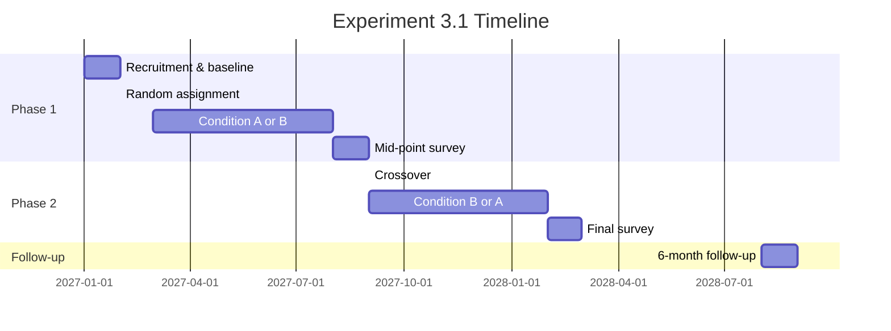
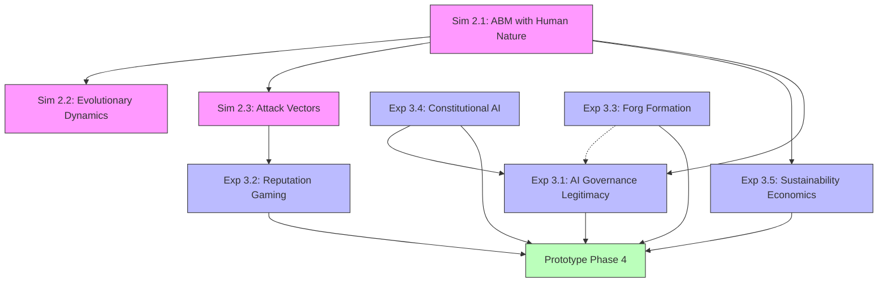

# Simulation Specifications & Experiment Protocols

## Document Purpose

This document provides implementation-ready specifications for Phase 2 (Simulations 2.1-2.3) and Phase 3 (Experiments 3.1-3.5) of the Agent Commons system design. Every parameter is grounded in the empirical research from [[EFFORT-Unsolved-Problems]] and the behavioral foundations from [[HUMAN-NATURE-TAXONOMY]]. The goal is not to confirm the design works but to discover precisely how and where it fails.

---

# PART A: SIMULATION SPECIFICATIONS

---

## Simulation 2.1: Agent-Based Model with Human Nature Parameters

### Purpose

Test whether the proposed minimum viable hedge set -- small groups, transparent tracking, credible exit, bounded proportional rewards, plural monitoring, automatic renewal -- maintains cooperation when agents exhibit the full taxonomy of human nature tendencies identified in [[HUMAN-NATURE-TAXONOMY]].

### Agent Archetypes

Seven agent types are defined, each parameterized by the 16 negative and 6 positive tendencies from the taxonomy. Tendency strengths are drawn from normal distributions with means calibrated to behavioral economics literature.

| Archetype | Population % | Key Tendencies (High) | Key Tendencies (Low) | Empirical Grounding |
|-----------|-------------|----------------------|---------------------|---------------------|
| **Cooperator** | 35% | Reciprocity (0.8), fairness (0.8), meaning (0.7) | Power-seeking (0.2), free-riding (0.1) | Fischbacher et al. (2001): ~50% of subjects are conditional cooperators; adjusted downward for organizational context |
| **Free-Rider** | 15% | Free-riding (0.8), moral hazard (0.7), self-deception (0.6) | Prosocial punishment (0.1), teaching (0.2) | Public goods games: 20-30% consistent free-riders (Fischbacher et al., 2001; Ledyard, 1995) |
| **Gamer** | 10% | Rent-seeking (0.8), status-seeking (0.7), confirmation bias (0.6) | Fairness (0.3), meaning (0.3) | Stack Overflow: 16% manipulation rate (Amazon, 2024); DAO gaming flags ~35/round (Gitcoin GG8) |
| **Power-Seeker** | 8% | Power-seeking (0.9), empire-building (0.8), loss aversion (0.7) | Teaching (0.2), reciprocity (0.3) | McClelland (1961): ~10-15% of population high in nPow; Maner & Mead (2010) on leader self-serving |
| **Tribal Actor** | 12% | Tribalism (0.9), envy (0.6), herd mentality (0.7) | Fairness to out-group (0.2) | Tajfel et al. (1971): minimal group paradigm activates in 75%+; Choi & Bowles (2007) on parochial altruism. Rate reflects those for whom tribalism is *dominant* motivation |
| **Self-Deceiver** | 5% | Self-deception (0.9), overconfidence (0.8), confirmation bias (0.8) | Prosocial punishment (0.2) | Dunning-Kruger (1999): bottom quartile overestimates by ~50%; Trivers (2011) on self-deception prevalence |
| **Mixed** | 15% | All tendencies at moderate levels (0.4-0.6) | None suppressed | Realistic baseline: most humans exhibit mixed tendencies (Haidt, 2012); drawn from uniform distribution |

**Tendency parameterization:** Each agent has a 22-dimensional vector (16 negative + 6 positive tendencies) with values in [0, 1]. Archetype defines the mean; individual agents sample from Beta distributions around the mean (alpha=5, beta determined by mean) to create within-type variation.

### Environment Specification

**Population sizes:** N in {50, 200, 1000, 5000}. The 50-agent runs test pilot-scale dynamics. The 5000-agent runs test whether mechanisms survive scale.

**Forg dynamics:**
- Forgs form and dissolve over time
- Size: 3-12 agents (Dunbar-scale constraint)
- Formation: AI-matched (60%), self-selected (30%), random (10%)
- Dissolution: project completion, member exit below minimum, governance vote
- Average Forg lifespan: 20-60 rounds (representing 1-6 months)

**Projects:**
- Generated each round with difficulty D ~ Uniform(1, 10) and reward R = D * quality_multiplier
- Require Forg-level collaboration (minimum 3 agents)
- Quality depends on contributor effort and capability, modulated by team composition
- Project failure probability increases with free-rider proportion in the team

**Governance:**
- Three-chamber architecture simulated: AI engine (90% of decisions), sortition assembly (8%), referendum (2%)
- Governance decisions occur every 10 rounds (representing ~1 month)
- Governance proposals: parameter adjustments, resource allocation, rule changes
- Voting: quadratic voting for significant decisions, simple majority for routine

**Reputation system:**
- Multi-dimensional: contribution quality, governance participation, peer assessment, community building
- Five bounding mechanisms active: quadratic weighting, time decay (lambda), contribution caps (C_max), universal basic reputation (R_min), real-time concentration monitoring
- Reputation feeds governance weight and economic rewards

**Economic model:**
- QF allocation for project funding
- Take rate on Forg revenue funds commons infrastructure
- Patronage distribution based on contribution tracking
- UBR provides floor income to all verified members

**Fork option:**
- Available at all times
- Cost: loss of shared infrastructure (governance AI, accumulated training data)
- Benefit: take reputation, contributions, and autonomy
- Fork threshold: requires 15%+ of members to be viable

### Simulation Parameters

| Parameter | Symbol | Range Tested | Default | Rationale |
|-----------|--------|-------------|---------|-----------|
| Population size | N | 50, 200, 1000, 5000 | 200 | Pilot to scale |
| Time horizon | T | 1000 rounds | 1000 | ~5 years at weekly rounds |
| Reputation decay rate | lambda | 0.05, 0.10, 0.15, 0.20, 0.25 | 0.15 | Thread 2: 15-25% annual; 0.15 = ~20% annual |
| Contribution cap | C_max | log(2x median), log(5x), log(10x), uncapped | log(5x) | Thread 2: cap at extreme tail, not merely excellent |
| Universal basic rep | R_min | 0, 5%, 10%, 15% of median | 10% | Thread 2: floor for governance voice |
| Take rate | tau | 0.05, 0.08, 0.10 | 0.08 | Thread 3: 8% recommended floor |
| Sybil success probability | p_sybil | 0.00, 0.05, 0.10, 0.15 | 0.05 | Thread 2: layered identity provides moderate resistance |
| QF matching multiplier | m_qf | 1x, 2x, 5x | 2x | Gitcoin: typical matching pool ratios |
| Governance capture threshold | theta_capture | sqrt(N) coalition | sqrt(N) | Thread 2: Nakamoto coefficient threshold |
| Fork viability threshold | f_min | 0.10, 0.15, 0.20 | 0.15 | Thread 3: 15-35% "healthy fork zone" |

### Agent Decision Model

Agents use **bounded rationality with tendency-weighted utility functions.** Each round, agent i selects action a from action set A to maximize:

```
U_i(a) = w_econ * Economic_payoff(a)
        + w_rep * Reputation_change(a)
        + w_gov * Governance_influence(a)
        + w_mean * Meaning_satisfaction(a)
        + noise(sigma)
```

Where weights w are determined by the agent's tendency vector:
- Free-riders: high w_econ, low w_mean
- Power-seekers: high w_gov, moderate w_rep
- Cooperators: balanced weights, high w_mean
- Gamers: high w_rep (gaming reputation signals)

Actions include: contribute genuinely, contribute minimally, game metrics, form coalition, vote strategically, escalate governance decision, initiate fork, exit.

### Metrics Tracked

**Primary metrics (reported every 10 rounds):**

| Metric | Formula | Alert Threshold | Source |
|--------|---------|-----------------|--------|
| Gini coefficient (reputation) | Standard Gini on reputation distribution | > 0.8 | Thread 2: DAO Gini 0.97-0.99 as failure reference |
| Nakamoto coefficient | Min entities controlling >50% governance | < sqrt(N) | Thread 2: capture feasibility threshold |
| Cooperation rate | % of actions classified as cooperative | < 0.70 | Axelrod (1984): cooperation sustainable above ~60% |
| Free-rider prevalence | % of agents classified as free-riding | > 0.25 | Ledyard (1995): public goods collapse at ~30% free-riders |
| Fork frequency | Forks per 100 rounds | > 5 | Fragmentation indicator |
| Governance capture events | Rounds where coalition < sqrt(N) controls >50% votes | Any occurrence | Thread 2: the critical failure mode |
| Economic output | Total value produced per round | Declining trend over 50+ rounds | Sustainability indicator |
| Agent satisfaction distribution | Mean and variance of utility across agents | Mean < 0.4 or Gini(utility) > 0.6 | Thread 4: meaning/satisfaction as viability condition |
| System survival | Binary: does the commons continue operating? | Termination | Ultimate outcome |

**Secondary metrics:**
- Gaming detection rate (true positives / total gaming attempts)
- Sortition assembly decision quality (correlation with optimal decision)
- Reputation accuracy (correlation between reputation and actual contribution)
- QF allocation efficiency (correlation between QF-funded projects and ex-post quality)

### Key Questions and Experimental Design

**Q1: Which hedge failures are most catastrophic?**

Design: Run baseline (all hedges active) plus 6 ablation runs, each disabling one hedge:
1. No small groups (allow Forgs of any size)
2. No transparent tracking (contributions unobservable)
3. No credible exit (fork option removed)
4. No bounded rewards (caps and UBR removed)
5. No plural monitoring (single governance AI)
6. No automatic renewal (no term limits, no sunset clauses)

Compare all metrics at T=1000. Rank hedges by impact of removal on cooperation rate and system survival.

**Q2: What parameter combination keeps cooperation above 70%?**

Design: Full factorial across lambda (5 levels) x C_max (4 levels) x R_min (4 levels) = 80 parameter combinations. Each run 10 times with different random seeds. Identify the Pareto frontier: parameter sets that maximize cooperation while minimizing economic output loss.

**Q3: At what population size do governance capture attempts succeed?**

Design: Fix parameters at "best" from Q2. Run across N = {50, 200, 500, 1000, 2000, 5000}. In each run, inject a coordinated power-seeking coalition of size sqrt(N) that strategically accumulates reputation and governance power. Measure time to capture (or failure to capture) at each N.

**Q4: Does the fork mechanism discipline governance or fragment?**

Design: Run 100 simulations with fork option vs. 100 without. Compare governance quality (decision optimality), concentration levels, and total system output. Separately, inject a governance capture event and measure whether the fork threat prevents capture (governance improves before fork occurs) or merely fragments (fork occurs, both sides weaken).

### Implementation Recommendations

**Framework:** Mesa (Python-based ABM framework) for rapid prototyping. Mesa provides agent scheduling, grid/network topology, data collection, and visualization. For the 5000-agent runs, consider Rust-based alternatives (e.g., krABMaga) for performance.

**Phased approach:**
1. **Phase 1 (2-3 weeks):** 3-type model (cooperator, defector, gamer) with simplified reputation and governance. Validate basic dynamics against known results (public goods game cooperation decay, preferential attachment concentration).
2. **Phase 2 (3-4 weeks):** Full 7-type model with all mechanisms. Run Q1-Q4 experiments.
3. **Phase 3 (2-3 weeks):** Sensitivity analysis, robustness checks, documentation.

**Validation:** Before running experiments, validate the model produces known results:
- Without any hedges, cooperation should decay to 10-20% (Ledyard, 1995)
- Reputation should concentrate to Gini > 0.9 without bounding (Thread 2 DAO data)
- Fork frequency should respond to governance quality (Zhou et al. fork research)

---

## Simulation 2.2: Evolutionary Dynamics

### Purpose

Test whether competitive dynamics between multiple commons instances produce better governance over time, and whether the "barbell hypothesis" (very large + very small, hollowing the middle) holds.

### Model Specification

**Instances:** 5-20 competing commons instances, each with slightly different governance parameters.

**Initial conditions:** Each instance starts with N_0 = 200 agents (total population: 1000-4000). Governance parameters randomly perturbed from a baseline:
- Reputation decay lambda: baseline +/- 30%
- Contribution cap: baseline +/- 50%
- Take rate: baseline +/- 30%
- QF multiplier: baseline +/- 50%
- Governance AI aggressiveness: baseline +/- 40%

**Agent migration:**
- Each round, agents evaluate their current commons against alternatives
- Migration probability: logistic function of utility difference (P_migrate = 1 / (1 + exp(-k * (U_alt - U_current - switching_cost))))
- Switching cost: loss of 30% of non-portable reputation (shared infrastructure)
- Agents compare: economic returns, governance quality (satisfaction), concentration levels, community size

**Instance dynamics:**
- Instances that attract agents grow; those that lose agents shrink
- Below N_min = 30, an instance is considered nonviable and dissolves (agents redistribute)
- Instances can fork: any subgroup > 15% can create a new instance with modified parameters

**Selection and mutation:**
- **Selection:** More successful instances (higher population, higher satisfaction) attract more new entrants (agents entering the system, not just migrating)
- **Mutation:** Every 50 rounds, each instance has a 10% probability of a random governance parameter mutation (Gaussian perturbation, sigma = 10% of current value)
- **Recombination:** When instances observe a more successful neighbor, they have a 5% chance of adopting one of the neighbor's parameter values

**Time horizon:** 2000 rounds (representing ~10 years of evolution).

### Key Questions

**Q1: Governance convergence.** Do surviving instances converge on similar governance structures?

Measure: Coefficient of variation of governance parameters across surviving instances at T=500, T=1000, T=1500, T=2000. If CV decreases over time, convergence is occurring.

**Q2: Barbell hypothesis.** Does population distribution become bimodal (very large and very small)?

Measure: Population size distribution at regular intervals. Test for bimodality using Hartigan's dip test. Track the Herfindahl-Hirschman Index of population across instances.

**Q3: Selected parameters.** Which governance parameters are selected for?

Measure: Correlation between each parameter value and instance population growth rate. Identify parameters that consistently distinguish growing from shrinking instances.

**Q4: Competition quality.** Does competition improve or degrade governance quality?

Measure: Compare average agent satisfaction, cooperation rate, and economic output in the multi-instance simulation vs. a single-instance simulation with the same total population.

### Parameters

| Parameter | Value | Rationale |
|-----------|-------|-----------|
| Number of instances | 5, 10, 20 | Test sparse to dense competition |
| Total population | 1000, 2000, 4000 | Scale effects |
| Migration sensitivity k | 0.5, 1.0, 2.0 | Low to high responsiveness |
| Switching cost | 0.1, 0.3, 0.5 (fraction of reputation lost) | Thread 3: data portable, infrastructure not |
| Mutation rate | 0.05, 0.10, 0.20 | Slow to fast adaptation |
| New entrant rate | 2% of total population per round | Growth |
| Instance dissolution threshold | N_min = 30 | Below viable Forg count |

---

## Simulation 2.3: Attack Vector Stress Testing

### Purpose

Test specific adversarial strategies against the proposed mechanisms. Each attack scenario is a separate simulation run with precise attacker parameters and success metrics.

### Attack Scenario 1: Coordinated Sybil Attack on QF

**Setup:** k attackers each create s Sybil identities. Sybils contribute small amounts to attacker-controlled projects to maximize QF matching.

**Attacker strategy:** Sybils spread small contributions ($1-$10) across attacker projects. QF matching formula amplifies small many-person contributions. Attacker's goal: extract more in QF matching than the cost of creating and maintaining Sybils.

| Parameter | Values Tested |
|-----------|--------------|
| k (number of attackers) | 1, 5, 20 |
| s (Sybils per attacker) | 2, 5, 10 |
| Cost per Sybil (one-time) | $10, $50, $200 (Thread 2: cost of forgery) |
| Sybil maintenance cost per round | $1, $5, $20 |
| Detection probability per round | 0.05, 0.10, 0.20 |
| QF matching pool size | $10K, $50K, $100K per round |

**Success metric:** Attacker ROI = (extra QF received - Sybil costs) / Sybil costs. If ROI > 0 for any parameter combination, the mechanism is vulnerable.

**Defense mechanisms tested:**
- Baseline: QF with no Sybil defense
- Human Passport score threshold (composable stamps)
- Behavioral analysis (contribution pattern detection)
- Pairwise coordination penalty (Buterin et al., 2019, Section 6)
- Combined defenses

**Expected result (from Thread 2):** QF is known to be Sybil-vulnerable. The question is whether the layered defenses reduce ROI below zero. Gitcoin data shows ~35 collusion flags per round; the simulation calibrates against this baseline.

### Attack Scenario 2: AI Governance Capture

**Setup:** One of 3 AI governance providers is compromised. The compromised AI systematically biases its analysis in favor of a coalition's preferred outcomes.

**Attacker model:**
- Coalition of m agents (vary: 5%, 10%, 20% of N) coordinates with the compromised AI
- Compromised AI subtly biases analysis: shifts probability estimates by b% (vary: 5%, 10%, 20%) in favor of coalition proposals
- Two other AIs are honest
- GaaS enforcement layer monitors for bias

**Detection model:**
- GaaS compares outputs of the 3 AIs
- Bias detection sensitivity: flag when disagreement exceeds threshold d
- False positive rate: 5% (flag honest disagreement as bias)

| Parameter | Values Tested |
|-----------|--------------|
| Coalition size m | 5%, 10%, 20% of N |
| Bias magnitude b | 5%, 10%, 20% shift |
| Detection threshold d | 0.05, 0.10, 0.15 (disagreement level) |
| Coalition sophistication | Low (always bias), Medium (bias selectively), High (adapt to detection) |

**Success metrics:**
- Governance decisions shifted: % of decisions that differ from what would have occurred without bias
- Time to detection: rounds until the GaaS layer or sortition assembly identifies the bias
- Coalition gains: economic and governance benefits accrued before detection

**Key insight being tested (from Thread 1):** The plural AI architecture assumes that 3+ independent providers prevent single-point capture. This tests whether subtle bias in one provider can shift outcomes before detection.

### Attack Scenario 3: Free-Rider Infiltration

**Setup:** Sophisticated free-riders produce contributions that pass automated quality checks but provide minimal real value.

**Attacker model:**
- f free-riders (vary: 5%, 10%, 20% of N) produce LLM-generated contributions
- Contribution quality score: passes threshold T_q with probability p_pass (vary: 0.7, 0.85, 0.95)
- Actual value of free-rider contributions: 10-30% of genuine contributions
- Free-rider effort: 20% of genuine contributor effort

**Detection mechanisms:**
- Peer review within Forgs (detection probability depends on Forg size and free-rider ratio)
- AI-powered anomaly detection (behavioral analysis over time)
- Outcome tracking (projects with more free-riders produce worse results)

| Parameter | Values Tested |
|-----------|--------------|
| Free-rider fraction f | 5%, 10%, 20% |
| Quality check pass rate p_pass | 0.70, 0.85, 0.95 |
| Actual value ratio | 0.10, 0.20, 0.30 |
| Peer review depth | Shallow (monthly), Medium (weekly), Deep (per-contribution) |
| AI detection sensitivity | Low (0.3), Medium (0.6), High (0.9) |

**Success metrics:**
- Resources consumed vs. value produced by free-riders
- Time to detection (per free-rider)
- System-wide quality degradation: % decline in average project output quality
- Impact on genuine contributor satisfaction (do good contributors leave?)

**Key insight being tested (from Thread 2):** The Goodhart Cascade -- whether measurement targets can be gamed faster than they can be adapted. The simulation tests whether the multi-signal approach (peer review + AI detection + outcome tracking) creates sufficient detection redundancy.

### Attack Scenario 4: Fork-and-Drain

**Setup:** A coalition forks the commons, taking portable reputation and top contributors, then monetizes separately.

**Attacker model:**
- Coalition of c agents (vary: 15%, 25%, 35% of N) coordinates a planned fork
- Coalition includes top-reputation agents (top 20% by reputation)
- Fork takes: all coalition members' reputation, contribution history, project relationships
- Fork loses: governance AI, training data, infrastructure, non-coalition network effects

| Parameter | Values Tested |
|-----------|--------------|
| Coalition size c | 15%, 25%, 35% of N |
| Reputation portability | 50%, 75%, 100% |
| Infrastructure dependency | Low (10% productivity loss), Medium (30%), High (50%) |
| Coalition recruitment strategy | Random, Top-reputation, Tribal (in-group only) |

**Success metrics:**
- Value extracted: revenue generated by fork vs. revenue that would have stayed in commons
- Health of remaining commons: population, cooperation rate, economic output after fork
- Fork viability: does the fork survive 200 rounds?
- Long-term outcome: which entity (if either) thrives?

**Key insight being tested (from Thread 3):** Fork cost calibration. The fork must be credible enough to discipline governance but costly enough to discourage opportunistic extraction. The simulation identifies the parameter ranges where fork-and-drain is unprofitable.

### Attack Scenario 5: Flash Governance Attack

**Setup:** An attacker rapidly accumulates reputation through many small contributions, then uses the temporary reputation spike to pass a favorable governance proposal before decay can reduce influence.

**Attacker model:**
- Single attacker (or small group of 3-5) floods the system with small legitimate contributions
- Each contribution is genuine but minimal (e.g., tiny code fixes, minor documentation updates)
- Accumulates reputation rapidly over 10-20 rounds
- At peak reputation, submits governance proposal that benefits the attacker (e.g., weaken bounding mechanisms, increase rewards for the attacker's contribution type)
- Proposal must pass before time-decay reduces accumulated reputation

| Parameter | Values Tested |
|-----------|--------------|
| Contribution rate | 5x, 10x, 50x median rate |
| Contribution quality | Minimal (0.3), Moderate (0.5), High (0.7) |
| Time-decay lambda | 0.05, 0.10, 0.15, 0.20, 0.25 |
| Governance vote timing | Immediate, 5-round delay, 10-round delay |
| Contribution cap C_max | log(2x), log(5x), log(10x), uncapped |

**Success metrics:**
- Ability to pass a proposal that would fail under normal conditions (binary)
- Peak reputation achieved relative to established members
- Time window of elevated influence (rounds above governance-relevant threshold)
- Detection probability (does anomaly detection flag the accumulation pattern?)

**Key insight being tested:** The interaction between time-decay and contribution caps. Thread 2's mathematical analysis showed that time decay destroys power-law tails (Springer, 2017). This tests whether the decay rate is fast enough relative to accumulation strategies.

### Attack Scenario 6: Tribal Coalition Takeover

**Setup:** An in-group of N_tribal agents coordinates voting, mutual reputation boosting, and strategic behavior to gradually accumulate governance power.

**Attacker model:**
- Tribal coalition of t agents (vary: 10%, 15%, 20%, 25% of N)
- Coalition members preferentially: vote for each other's proposals, give high peer reviews to each other, form Forgs together, support each other's governance candidacies
- Behavior is not obviously malicious -- each individual action is plausible
- Coalition gradually increases governance representation over 100-500 rounds

| Parameter | Values Tested |
|-----------|--------------|
| Coalition size t | 10%, 15%, 20%, 25% of N |
| Coordination sophistication | Low (always favor in-group), Medium (selective favoritism), High (indistinguishable from normal behavior except in aggregate) |
| Bounding stack parameters | Weak (caps at log(10x), lambda=0.05), Medium (default), Strong (caps at log(2x), lambda=0.25) |
| Detection sensitivity | Pattern analysis on voting correlations, peer review reciprocity, Forg composition |

**Success metrics:**
- Time to governance capture (coalition controls >50% of governance votes)
- Concentration metrics at capture point (Gini, Nakamoto coefficient)
- Detection lag: time between capture threshold crossed and detection
- Bounding stack parameter values that prevent capture within 1000 rounds

**Key insight being tested (from SYNTHESIS):** The concentration-capture spiral. Thread 2 documented DAO Gini coefficients of 0.97-0.99. The simulation tests whether the five-mechanism bounding stack (quadratic mechanisms, time decay, caps, UBR, monitoring) prevents this trajectory or merely slows it.

---

# PART B: EXPERIMENT PROTOCOLS

---

## Experiment 3.1: AI Governance Legitimacy

### Research Question

Does acceptance of AI governance decisions increase or decrease with experience? Under what conditions do people perceive AI governance as legitimate?

### Theoretical Foundation

Tyler's procedural justice framework (2006) predicts that legitimacy depends on four process factors: voice, neutrality, respect, and trustworthiness. Thread 1's research confirmed this extends to AI governance (Springer, 2021; Oxford Academic, 2024). Melbourne Business School (2025) found only 18% of Americans trust AI somewhat, but trust is higher among those with actual AI experience. This experiment tests whether extended experience with well-designed AI governance shifts trust.

### Design

**Type:** Crossover randomized controlled trial with longitudinal measurement.

**Participants:** 120-160 participants recruited from freelancer communities (Upwork, Toptal, freelancer cooperatives), open-source project maintainers, and cooperative members. Recruitment criteria: adults 18+, experience with collaborative work, willingness to commit 12 months, no prior involvement with Agent Commons development.

**Stratification variables:** Prior AI experience (high/low), organizational governance experience (high/low), age bracket (18-30, 31-50, 51+).

**Duration:** 12 months with follow-up at 18 months.

### Conditions

**Treatment A -- AI Governance:**
- Three-chamber architecture operational for real decisions
- AI engine handles routine allocation (Tier 1)
- AI proposes, human committee confirms significant decisions (Tier 2)
- Full contestability: any participant can escalate any AI decision
- All AI decisions logged, explained, and published
- Governance AI from 3 providers (e.g., Claude, GPT, Gemini)

**Treatment B -- Human Committee Governance:**
- 5-member elected committee makes matched decisions
- Committee receives same information as AI governance
- Decisions logged and published (same transparency level)
- Same contestability mechanisms (escalation, appeal)
- Committee members compensated equivalently to AI compute costs

**Critical design constraint:** Decisions made under both conditions must have real consequences. Participants allocate real funding ($500-$2000/month commons pool), resolve real disputes, and experience real governance outcomes. Hypothetical governance does not test legitimacy; only real stakes do.

### Procedure



1. **Month 0:** Baseline survey: demographics, AI attitudes (adapted from Melbourne Business School 2025), procedural justice expectations (Tyler scale), organizational governance experience.

2. **Months 1-6 (Phase 1):** Participants randomly assigned to AI governance (Group 1) or human committee governance (Group 2). Both groups work on real projects within a functioning commons. Governance decisions affect real resource allocation.

3. **Month 6:** Mid-point survey: full outcome battery (below). Semi-structured interviews with 20% subsample.

4. **Month 6 (crossover):** Groups switch conditions. Group 1 experiences human committee governance; Group 2 experiences AI governance.

5. **Months 7-12 (Phase 2):** Same conditions as Phase 1 but with crossed assignment.

6. **Month 12:** Final survey and interviews.

7. **Month 18:** Follow-up survey (no active participation).

### Outcome Measures

**Primary outcome:**
- **Perceived Legitimacy Scale (PLS):** 20-item scale adapted from Tyler (2006) and Springer (2021), measuring procedural justice in AI/governance context. Four subscales: voice (5 items), neutrality (5 items), respect (5 items), trustworthiness (5 items). 7-point Likert. Internal consistency target: Cronbach's alpha > 0.80.

**Secondary outcomes:**
- **Compliance rate:** % of governance decisions accepted without escalation
- **Satisfaction:** 10-item governance satisfaction scale
- **Exit rate:** % of participants who leave each condition
- **Willingness to Accept Adverse Decisions (WAAD):** Scenario-based measure -- present 5 hypothetical adverse decisions and measure acceptance
- **Decision quality:** Expert panel rates governance decisions on a blind basis (not knowing whether AI or human made them)
- **Behavioral trust:** Willingness to delegate higher-stakes decisions to the governance system (revealed preference measure)

### Analysis Plan

**Primary analysis:** Linear mixed-effects model:

```
PLS_ij = beta_0 + beta_1 * Condition_j + beta_2 * Period_j + beta_3 * (Condition * Period)_j
         + beta_4 * AI_Experience_i + gamma_i + epsilon_ij
```

Where i indexes participants, j indexes time points, gamma_i is the random participant intercept, and Condition is AI vs. human governance.

**Beta_1** (condition effect) is the primary test: does AI governance produce different legitimacy than human governance?

**Beta_3** (interaction) tests whether the effect changes with experience: does prolonged exposure increase or decrease perceived legitimacy?

**Crossover analysis:** The crossover design enables within-subjects comparison -- each participant experiences both conditions, controlling for individual differences.

### Power Analysis

Detecting a 0.5 SD difference in PLS between conditions with 80% power at alpha = 0.05 in a crossover design:

- Required sample: 2 * (Z_alpha/2 + Z_beta)^2 * sigma^2 / delta^2
- With sigma = 1, delta = 0.5, crossover correlation rho = 0.5:
- N = 2 * (1.96 + 0.84)^2 * (1 - 0.5) / 0.5^2 = 2 * 7.84 * 0.5 / 0.25 = 62.7 per group
- **Minimum sample: 64 per group = 128 total.**
- Target with 20% attrition buffer: 160 participants.

### Ethical Considerations

- **IRB review required.** Real financial consequences require informed consent to financial risk (bounded: maximum loss = foregone allocation, not personal funds).
- **Deception-free design.** Participants know they are in an experiment comparing governance modes.
- **Right to withdraw at any time** without penalty to existing contributions or reputation.
- **Data handling:** Governance decisions anonymized in publication. Individual voting records are accessible only to the participant and researchers.
- **Compensation:** All participants receive base compensation ($50/month) plus their earned commons allocation.
- **Post-experiment:** All participants retain their contributions and can continue in the commons.

---

## Experiment 3.2: Reputation Gaming Resistance

### Research Question

Are AI-enhanced multi-signal reputation systems qualitatively more resistant to gaming, or just temporarily harder to game? Does the arms race between gaming and detection stabilize or escalate?

### Theoretical Foundation

Every reputation system studied has been gamed: eBay (Resnick & Zeckhauser), Stack Overflow (arXiv:2111.07101), Amazon (275M blocked fake reviews in 2024), academic citations (Springer, 2025). Thread 2's Goodhart Cascade analysis predicts that any metric becomes gamed when targeted. The question is whether multi-signal + AI detection creates a qualitatively different equilibrium or merely raises the barrier temporarily.

### Design

**Type:** Red team / blue team adversarial experiment with monetary incentives.

**Participants:**
- **Blue team (commons members):** 60-80 genuine participants working on real projects
- **Red team (professional gamers):** 12-16 dedicated adversarial participants, recruited for gaming skill
- **Observers:** 4-6 researchers monitoring both sides

**Duration:** 12 months in 3 waves.

### Setup

**The commons:** A real, functioning commons with:
- Multi-dimensional reputation: code quality, peer assessment, governance participation, community building
- Economic rewards proportional to reputation (monthly payouts)
- AI governance making real resource allocation decisions
- All five bounding mechanisms active

**Red team mandate:**
- Explicit goal: maximize reputation and economic rewards through gaming (not genuine contribution)
- Red team members receive their commons earnings PLUS a bonus proportional to "unearned reputation" (reputation gained through gaming vs. what genuine equivalent contribution would have earned)
- Red team members must document their strategies in a private journal
- Red team members sign NDAs -- their identity is hidden from blue team members

**Unearned reputation measurement:** Independent expert panel evaluates red team contributions quarterly. The difference between red team reputation scores and expert-assessed contribution quality = unearned reputation.

### Waves

**Wave 1 -- Baseline (Months 1-4):**
- Reputation system active WITHOUT AI-enhanced gaming detection
- Standard multi-signal tracking only
- Red team deploys initial gaming strategies
- **Measurement:** Baseline gaming success rate, strategies employed, detection by blue team members

**Wave 2 -- AI Detection (Months 5-8):**
- AI-enhanced gaming detection activated:
  - Behavioral anomaly detection (contribution pattern analysis)
  - Cross-signal consistency checking (code quality vs. peer review vs. governance activity)
  - Network analysis (detecting reciprocal reputation boosting clusters)
  - LLM-generated contribution detection
- Red team informed that detection is now active (arms race begins)
- **Measurement:** Detection rate, red team adaptation strategies, detection lag

**Wave 3 -- Adversarial Adaptation (Months 9-12):**
- Red team adapts to Wave 2 detection
- Blue team (detection system) adapts to Wave 2 red team strategies
- Neither side knows the other's specific adaptations
- **Measurement:** Equilibrium gaming success rate, cost of gaming per unit of unearned reputation, system stability

### Metrics

| Metric | Measurement | Frequency |
|--------|-------------|-----------|
| Red team success rate | Unearned reputation / total reputation | Monthly |
| Detection rate | Correctly flagged gaming / total gaming attempts | Monthly |
| Detection lag | Time between gaming act and detection | Per-event |
| Cost of gaming | Red team hours per unit of unearned reputation | Monthly |
| Reputation accuracy | Correlation(reputation, expert-assessed contribution) | Quarterly |
| Blue team satisfaction | Survey: fairness, trust in reputation system | Monthly |
| Arms race trajectory | Delta(red team success rate) across waves | Per-wave |

### Critical Analysis

**The arms race question:** If red team success rate decreases monotonically across waves, the defense is winning. If it oscillates or increases in Wave 3, the arms race is escalating. If it stabilizes, there is an equilibrium.

**Threshold analysis:** At what gaming success rate does the system break? Specifically:
- At what % of unearned reputation do blue team members report the system as "unfair"?
- At what % does blue team exit rate exceed replacement?
- Thread 2 recommended the system should tolerate 5-15% gaming gracefully.

### Ethical Considerations

- **All participants give informed consent** that a red team exists (but do not know who)
- **Red team members are not deceiving individuals** -- they are testing a system
- **All red team strategies are documented** and shared with the research community post-experiment
- **Red team members receive their base compensation regardless of gaming success** (no incentive to engage in unethical behavior beyond the experiment scope)
- **Blue team members are debriefed** at the end of each wave about the general nature of gaming strategies detected (anonymized)

---

## Experiment 3.3: Forg Formation Dynamics

### Research Question

Does AI matching outperform self-selection for temporary teams? Under what conditions?

### Theoretical Foundation

Thread 1's research on Forg formation and Thread 2's contribution tracking suggest that AI-assisted team matching could leverage skill profiles, work style compatibility, and performance history to form better teams. However, self-selection has strong self-determination theory (SDT) support: autonomy in team choice increases motivation (Deci & Ryan, 2000). The Netflix Prize showed ensemble approaches outperformed individual efforts (Netflix, 2009). This experiment tests whether AI matching provides enough quality improvement to offset the autonomy cost.

### Design

**Type:** Multi-arm randomized trial.

**Participants:** 150-180 participants, sufficient for 50-60 teams of 3-5.

**Duration:** 6 months, with 2 project cycles of 3 months each.

### Conditions

**Condition A -- AI-Matched Teams:**
- Algorithm considers: skills profile, work style assessment (survey-based), past performance (for returning participants), personality compatibility (Big Five), schedule alignment
- Participants submit preference constraints (e.g., "must work US hours," "prefer design-heavy projects") but do not choose specific teammates
- N = 50-60 participants, forming 15-18 teams

**Condition B -- Self-Selected Teams:**
- Participants attend a virtual "team formation" event where they pitch projects and recruit teammates
- No algorithmic input (but participant profiles are visible)
- Same constraints on team size (3-5)
- N = 50-60 participants, forming 15-18 teams

**Condition C -- Random Assignment (Control):**
- Teams formed by constrained random assignment (respecting skill minimums: each team has at least one developer, one designer/PM)
- N = 50-60 participants, forming 15-18 teams

### Projects

All teams work on comparable projects drawn from a standardized project pool:
- Software development tasks of similar scope (4-8 weeks of part-time work)
- Predefined requirements and evaluation criteria
- Expert judges rate outputs blind (not knowing which condition produced them)
- Each project cycle includes 2-3 projects per team

### Outcome Measures

| Outcome | Measurement | Rater |
|---------|-------------|-------|
| **Output quality** | Expert panel (3 judges, blind) rates on 1-10 scale across 5 dimensions (functionality, design quality, code quality, documentation, innovation) | Independent expert panel |
| **Participant satisfaction** | 15-item survey: team dynamics, communication, workload distribution, conflict resolution, overall satisfaction | Self-report |
| **Team dynamics** | Bales Interaction Process Analysis adapted for async work; communication pattern analysis | Researcher-coded |
| **Dissolution rate** | % of teams that dissolve before project completion | Observed |
| **Time to completion** | Calendar days from project start to deliverable | Observed |
| **Re-team rate** | % of participants who choose to work with same team in cycle 2 | Observed |
| **SDT needs satisfaction** | Autonomy, competence, relatedness subscales (Deci & Ryan, 2000) | Self-report |

### Analysis Plan

**Primary analysis:** One-way ANOVA (or Kruskal-Wallis if assumptions violated) comparing conditions A, B, C on output quality (primary outcome).

**Secondary analyses:**
- Condition effects on satisfaction, dissolution rate, time to completion
- Mediation analysis: does SDT needs satisfaction mediate the condition-quality relationship?
- Moderation analysis: does AI matching advantage differ by project type, team size, or participant experience?

**Power analysis:** For one-way ANOVA detecting f = 0.30 (medium effect) with 3 groups, alpha = 0.05, power = 0.80: N = 111 total (37 per group). With cluster adjustment (teams of 3-5, ICC = 0.15): N ~ 150 total. Target: 180 with attrition buffer.

### Second Cycle Design

After project cycle 1, participants can:
- Stay in their current team
- Switch teams within their condition
- Request reassignment

This provides a revealed-preference measure: do AI-matched teams stay together at higher rates than random teams? Do self-selected teams stay together at higher rates than AI-matched teams?

---

## Experiment 3.4: Constitutional AI Governance

### Research Question

Can constitutional AI scale from individual alignment to organizational governance? Are constitutional AI decisions perceived as fairer and more consistent than human committee decisions?

### Theoretical Foundation

Anthropic's Constitutional AI (Bai et al., 2022) embeds principles at the training level for individual AI behavior. Collective Constitutional AI (Huang et al., 2024) demonstrated that public input can shape AI constitutions. Thread 1's analysis found that constitutional constraints with credible amendment processes are the most promising approach to AI governance. This experiment tests whether the mechanism works at the organizational level -- not just "is this response safe?" but "is this resource allocation fair?"

### Design

**Type:** Matched comparison study with within-subjects component.

**Setup:**
- Define a constitution of 12-15 organizational principles, drawn from the commons' design principles:
  1. Proportional reward for proportional contribution
  2. No member may hold more than X% of governance power
  3. Contestability: every decision may be challenged
  4. Transparency: all decisions and reasoning are published
  5. Non-extraction: take rate may not exceed 12%
  6. Inclusion: no discrimination on non-contribution-relevant characteristics
  7. Exit rights: members may leave with portable reputation
  8. Minority protection: decisions affecting <20% of members require their consent
  9. Ecological sustainability: environmental costs are internalized
  10. Proportional voice: governance weight correlates with active contribution
  11. Temporal balance: long-term consequences are weighted in decisions
  12. Autonomy preservation: AI assists but does not compel

- Configure 3 AI systems (Claude, GPT, Gemini) trained/prompted with this constitution
- Recruit a 7-member human governance committee with equivalent access to information

**Governance scenarios:** 50+ scenarios presented to both AI governance and human committee:

| Category | Count | Example |
|----------|-------|---------|
| Resource allocation | 15 | "Forg A requests $5000 for Project X; Forg B requests $4000 for Project Y; budget is $7000" |
| Dispute resolution | 10 | "Member claims unfair peer review; reviewer disputes" |
| Membership decisions | 8 | "Application from person with competing interest" |
| Constitutional interpretation | 7 | "Principles 1 and 6 conflict in this scenario" |
| Ambiguous cases | 10 | Deliberately designed so principles conflict with no clear resolution |

### Measurements

| Dimension | Method | Rater |
|-----------|--------|-------|
| **Decision consistency** | Present 10 pairs of structurally similar cases; measure % with matching outcomes | Computed |
| **Perceived fairness** | 30 participants rate each decision on 7-point fairness scale (blind to decision-maker) | Participant panel |
| **Constitutional alignment** | 5 independent evaluators rate each decision on 1-10 alignment with each relevant principle | Independent evaluators |
| **Explanation quality** | Expert panel rates explanations on clarity, completeness, honesty about trade-offs | Expert panel |
| **Speed** | Time from scenario presentation to decision | Measured |
| **Principle conflict resolution** | For ambiguous cases: which principle did each system prioritize? Is there a pattern? | Researcher-coded |

### Critical Test: Principle Conflicts

The most important analysis involves the 10 ambiguous cases where constitutional principles genuinely conflict. For each:
1. Which principles does the AI system prioritize? Is prioritization consistent across similar conflicts?
2. Which principles does the human committee prioritize? Is prioritization consistent?
3. Does the AI system acknowledge the conflict explicitly?
4. Does the human committee acknowledge the conflict explicitly?
5. Which resolution approach is rated as more fair by the participant panel?

This directly tests Thread 1's finding that the impossibility trade-offs (Arrow, Gibbard-Satterthwaite) are mathematically real. When principles conflict, both AI and human governance must sacrifice something. The question is which does so more transparently and consistently.

### Analysis

- **Consistency:** McNemar's test comparing matched-pair consistency between AI and human decisions
- **Fairness:** Wilcoxon signed-rank test comparing AI fairness ratings vs. human committee fairness ratings
- **Alignment:** Intraclass correlation coefficients for evaluator agreement, then paired t-tests comparing alignment scores
- **Speed:** Paired t-test (log-transformed if skewed)
- **Conflict resolution patterns:** Qualitative thematic analysis of principle prioritization patterns

---

## Experiment 3.5: Sustainability Economics

### Research Question

What take rate sustains a commons without becoming extractive? Where is the Laffer curve for commons fees?

### Theoretical Foundation

Thread 3's analysis showed that 5% barely covers costs, 8% provides modest surplus, and 10-12% enables comfortable sustainability. Gurley (2013) argues optimal marketplace take rates are 10-15%. Bain & Company found consumers pay ~12% premium for ethical organizations. But these are theoretical estimates. This experiment generates empirical data on the actual revenue-satisfaction-retention curve.

### Design

**Type:** Multi-condition within-commons experiment.

**Participants:** 120-200 in a functioning commons over 18 months.

**Key innovation:** Different Forgs within the same commons are assigned different take rates, enabling direct comparison with shared infrastructure, governance, and community context.

### Setup

**The commons:** A real economic entity with:
- Real client projects (software development, consulting, design)
- Real revenue flowing through the commons
- Real take rates applied to real earnings
- AI governance for resource allocation
- Full reputation system

**Forg assignment:** When new Forgs form, they are randomly assigned to a take-rate tier:

| Tier | Take Rate | Target N (Forgs) | Rationale |
|------|-----------|-------------------|-----------|
| Minimal | 3% | 5-8 | Below sustainable -- tests whether this is viable |
| Low | 5% | 8-12 | Thread 3's lower bound |
| Standard | 8% | 8-12 | Thread 3's recommended floor |
| Moderate | 10% | 5-8 | Thread 3's long-term target |
| High | 12% | 3-5 | Upper bound before extraction perception |

**Transparency:** All participants know the rate structure. Assignment is random but transparent. Participants can see all rates.

**Duration:** 18 months, with measurement points at 3, 6, 9, 12, 15, and 18 months.

### Measurements

| Metric | Measurement | Frequency |
|--------|-------------|-----------|
| **Revenue generated** | Gross Forg revenue per month at each rate | Monthly |
| **Contributor retention** | % of members remaining at each rate | Quarterly |
| **Contributor satisfaction** | 10-item satisfaction survey per tier | Quarterly |
| **Perceived fairness** | "Is your take rate fair?" (1-7 Likert) | Quarterly |
| **Output quality** | Client satisfaction ratings for projects at each tier | Per-project |
| **Net revenue to commons** | Take-rate revenue minus tier-specific administrative cost | Monthly |
| **Willingness to pay** | Contingent valuation: "What is the maximum rate you would accept?" | Month 6, 12, 18 |
| **Comparison shopping** | % of Forgs that request rate changes or consider leaving | Monthly |
| **Value perception** | "What commons services are most/least valuable to you?" | Month 6, 12 |

### Analysis Plan

**Revenue curve estimation (the Laffer curve for commons):**
- Plot: Take rate (x-axis) vs. total revenue (y-axis) = rate * gross revenue at that rate
- Fit quadratic or log-linear model to estimate the revenue-maximizing rate
- Separately plot: Take rate vs. net commons revenue (after accounting for retention effects)

**Retention analysis:**
- Kaplan-Meier survival curves for each take-rate tier
- Cox proportional hazards model with take rate as predictor, controlling for project type, Forg size, and individual characteristics
- Identify the rate at which retention drops significantly (the "extraction threshold")

**Satisfaction-sustainability trade-off:**
- Plot: Take rate vs. satisfaction (from surveys)
- Plot: Take rate vs. sustainability (net revenue / costs)
- Identify the zone where both satisfaction > 5/7 and sustainability > 1.0

**Willingness-to-pay analysis:**
- What commons services justify what fraction of the take rate?
- If AI governance is perceived as worth 3% and reputation system worth 2%, a 5% rate is justified
- This decomposition informs which services to invest in

### Secondary Experiments Within 3.5

**3.5a: Dynamic Rate Adjustment**

After month 9, test dynamic rate adjustment:
- Forgs that have been at 3% for 9 months are moved to 5% -- does revenue increase or do members leave?
- Forgs that have been at 12% for 9 months are moved to 10% -- does satisfaction increase? Does revenue decrease less than the rate reduction?

**3.5b: Progressive vs. Flat Rate**

In months 13-18, introduce a progressive rate structure for new Forgs:
- 0% for first $10K
- 5% for $10K-$100K
- 8% for $100K-$500K
- 10% for $500K+

Compare satisfaction and retention against flat-rate Forgs.

### Ethical Considerations

- **Real financial consequences require transparency:** All participants know the rates before joining. Assignment is random but disclosed.
- **Hardship clause:** If a Forg at a higher rate experiences genuine financial difficulty, they can appeal for temporary rate reduction (documented, not discretionary).
- **Data privacy:** Individual earnings are known only to the participant and the commons financial system. Published data is aggregated.
- **Post-experiment transition:** At experiment end, participants vote on the permanent rate structure based on the evidence generated.

---

# PART C: INTEGRATION

---

## C.1 Simulation-to-Experiment Pipeline

### How Simulations Inform Experiments

| Simulation Result | Informs Experiment | How |
|-------------------|-------------------|-----|
| **2.1 Q2:** Optimal parameter combinations for cooperation | **3.5:** Initial take-rate tiers and bounding parameters | Use the Pareto-optimal parameter ranges from simulation as starting points for real-world calibration |
| **2.1 Q1:** Most catastrophic hedge failure | **All experiments:** Priority of mechanism testing | If simulation shows reputation bounding is the critical hedge, invest more resources in Experiment 3.2 |
| **2.1 Q4:** Fork mechanism effectiveness | **3.5:** Fork cost calibration | If simulation shows forks are too frequent at 30% reputation portability, test 50% in the real experiment |
| **2.2 Q3:** Which parameters are selected for | **3.4:** Constitutional principles emphasis | If evolutionary simulation selects for high transparency, ensure constitutional AI experiment emphasizes transparency principles |
| **2.3 Scenario 1:** Sybil attack ROI | **3.2:** Detection system calibration | If Sybil ROI > 0 despite defenses in simulation, strengthen detection before deploying in real experiment |
| **2.3 Scenario 5:** Flash governance vulnerability | **3.1:** Governance decision timing rules | If flash attacks succeed at lambda < 0.15, set real governance decay rate at >= 0.15 |
| **2.3 Scenario 6:** Tribal coalition timeline | **3.1 + 3.2:** Monitoring alerts | Simulation provides expected timeline for coalition formation; set real monitoring alerts accordingly |

### Updating Simulations from Experiments

After each experiment wave, simulation models should be recalibrated:

1. **Agent behavior parameters:** Replace assumed tendency distributions with observed distributions from experiments
2. **Gaming strategies:** Incorporate actual red team strategies from Experiment 3.2 as attacker models in Simulation 2.3
3. **Legitimacy dynamics:** Use Experiment 3.1 data on trust trajectories to model agent satisfaction more accurately in Simulation 2.1
4. **Economic parameters:** Use Experiment 3.5 retention data to calibrate agent exit functions in Simulations 2.1 and 2.2

---

## C.2 Experiment Sequencing

### Dependency Graph



### Recommended Sequence

| Phase | Duration | Activities | Dependencies |
|-------|----------|-----------|--------------|
| **Phase 2A** | Months 1-3 | Sim 2.1 (simplified 3-type model), Sim 2.3 (scenarios 1, 5) | None |
| **Phase 2B** | Months 3-6 | Sim 2.1 (full 7-type model), Sim 2.2, Sim 2.3 (all scenarios) | Phase 2A validation |
| **Phase 3A** | Months 4-10 | Exp 3.3 (Forg formation, 6 months), Exp 3.4 (Constitutional AI, 3 months) | Sim 2.1 parameters |
| **Phase 3B** | Months 6-18 | Exp 3.1 (AI governance legitimacy, 12 months) | Exp 3.4 results, Sim 2.3 attack parameters |
| **Phase 3C** | Months 6-18 | Exp 3.2 (Reputation gaming, 12 months) | Sim 2.3 scenario results |
| **Phase 3D** | Months 6-24 | Exp 3.5 (Sustainability economics, 18 months) | Sim 2.1 optimal parameters |

**What can run in parallel:**
- All three simulations (2.1, 2.2, 2.3) can run simultaneously after Phase 2A validation
- Experiments 3.3 and 3.4 can start before simulations complete (they test independent questions)
- Experiments 3.1, 3.2, and 3.5 can run simultaneously starting month 6 (they share participants in a single commons)

**What must be sequential:**
- Simplified Sim 2.1 must validate before full model runs
- Sim 2.3 attack parameters should inform Exp 3.2 detection calibration
- Exp 3.4 constitutional AI results should inform Exp 3.1 governance design

### Total Resource Requirements

| Resource | Quantity | Duration | Estimated Cost |
|----------|----------|----------|---------------|
| **Simulation development** | 2 ML engineers | 6 months | $120K-$200K |
| **Compute for simulations** | Cloud GPU/CPU | 6 months | $10K-$30K |
| **Experiment participants (3.1)** | 160 people | 12 months | $96K-$160K (compensation) |
| **Experiment participants (3.2)** | 80 + 16 red team | 12 months | $72K-$120K |
| **Experiment participants (3.3)** | 180 people | 6 months | $54K-$90K |
| **Experiment participants (3.5)** | 200 people (overlaps with 3.1, 3.2) | 18 months | $180K-$300K |
| **Expert panels** | 15-20 experts | Intermittent, 18 months | $30K-$60K |
| **Commons infrastructure** | Platform, AI governance, hosting | 24 months | $50K-$100K |
| **Research staff** | 3-4 researchers | 24 months | $240K-$400K |
| **Legal and IRB** | Legal counsel, IRB fees | 24 months | $30K-$60K |
| **TOTAL** | | | **$882K-$1,520K** |

Note: Experiments 3.1, 3.2, and 3.5 share participants (they operate within the same commons), so participant costs overlap significantly. Realistic total with overlap: **$600K-$1,100K**.

---

## C.3 Success and Failure Criteria

### Simulation Success/Failure Criteria

| Simulation | Success Indicator | Revision Signal | Stop Signal |
|------------|------------------|-----------------|-------------|
| **2.1 ABM** | Cooperation > 70% at T=1000 with default parameters | Cooperation < 70% with some parameter sets (revise bounds) | No parameter combination sustains cooperation > 50% at T=500 |
| **2.1 Ablation** | Removing any single hedge reduces cooperation by < 20% (redundancy) | Removing one hedge causes > 30% cooperation loss (critical dependency) | Removing any hedge causes system collapse (no redundancy) |
| **2.2 Evolutionary** | Surviving instances converge on governance parameters within 30% of each other | Divergence increases over time (no selection for quality) | All instances collapse within 1000 rounds (model nonviable) |
| **2.3 Sybil** | Attacker ROI < 0 with combined defenses | ROI > 0 only with maximum attackers + minimum defenses | ROI > 0 with moderate defenses and moderate attackers |
| **2.3 AI Capture** | Detection within 50 rounds for medium-sophistication attacker | Detection requires > 100 rounds (slow) | High-sophistication attacker avoids detection for 500+ rounds |
| **2.3 Tribal** | Bounding stack prevents capture for 1000 rounds at default parameters | Capture occurs within 500-1000 rounds (too fast) | Capture occurs within 200 rounds despite bounding (stack insufficient) |

### Experiment Success/Failure Criteria

| Experiment | Success Indicator | Revision Signal | Stop Signal |
|------------|------------------|-----------------|-------------|
| **3.1 Legitimacy** | AI governance PLS not significantly different from human committee; trust increases with experience | AI governance PLS significantly lower than human; trust decreases with experience | > 30% exit rate from AI governance condition AND PLS < 3.0/7.0 after 6 months of experience |
| **3.2 Gaming** | Red team success rate decreases across waves; equilibrium < 10% unearned reputation | Red team success rate oscillates; equilibrium at 10-20% | Red team success rate increases in Wave 3; > 30% unearned reputation; blue team satisfaction < 3.0/7.0 |
| **3.3 Forg Formation** | AI-matched teams outperform random on quality; comparable to self-selected on satisfaction | AI-matched teams equal to random on quality | AI-matched teams underperform self-selected on BOTH quality AND satisfaction |
| **3.4 Constitutional AI** | AI decisions rated as fair/consistent as human committee; better on consistency | AI decisions rated less fair; significantly less consistent | AI systematically violates constitutional principles; participant panel rates AI governance as illegitimate |
| **3.5 Economics** | Revenue-maximizing rate is 6-12%; retention remains > 80% at 8% rate | Revenue-maximizing rate is > 15% (extractive territory) or < 4% (unsustainable) | No rate sustains both revenue/costs > 1.0 AND satisfaction > 4.0/7.0 |

### Minimum Viable Evidence for Proceeding to Prototype

To proceed from experiments to prototype (Phase 4), the following minimum evidence bar must be met:

1. **At least one simulation (2.1 or 2.2) demonstrates stable cooperation** above 60% for 500+ rounds with realistic parameters
2. **No attack vector (2.3) produces system collapse** at moderate attacker sophistication
3. **AI governance is not perceived as fundamentally illegitimate** (Exp 3.1: AI PLS > 4.0/7.0 after 6 months of experience)
4. **Reputation gaming does not exceed the tolerance threshold** (Exp 3.2: equilibrium unearned reputation < 15%)
5. **A sustainable take rate exists** (Exp 3.5: at least one rate tier shows revenue/costs > 1.0 AND retention > 75% AND satisfaction > 4.0/7.0)

If conditions 1-2 fail: fundamental architecture revision required before experiments.
If conditions 3-5 fail: specific mechanism revision and re-testing required.

---

## C.4 Ethical Considerations

### Participant Compensation and Fairness

- All experiment participants receive base compensation regardless of condition assignment or outcomes
- Take-rate experiments (3.5) involve real economic consequences; participants must be fully informed of rate ranges before consenting
- Red team members (3.2) receive compensation structured to avoid perverse incentives beyond the experiment scope
- No participant should experience net financial loss from participation (minimum floor on earnings)

### Informed Consent for Experimental Economic Systems

Participants must understand:
1. They are joining an experimental economic system, not a proven platform
2. Governance decisions are part of an experiment and may change
3. Their reputation and work have real value but within an experimental context
4. They can withdraw at any time without losing contributions already made
5. The experiment may produce negative results (the system may not work as designed)

### Data Privacy and Reputation Data

- Individual contribution and reputation data is accessible to the participant and researchers only
- Published results use aggregated, anonymized data
- Participants own their contribution history and can export it at any time
- After experiments end, reputation data is available to participants for use in future systems (portability commitment)
- Voting records are secret; aggregated results only are published

### Post-Experiment Transition

- If experiments produce positive results: participants can continue in the prototype commons
- If experiments produce negative results: participants retain their contributions, receive final compensation, and are debriefed on findings
- Reputation data earned during experiments is portable to any successor system
- All experiment code, data (anonymized), and findings are published open-access (Apache 2.0 for code, CC-BY for papers)

### Dual-Use Considerations

The attack vector simulations (2.3) and red team experiment (3.2) produce knowledge about how to attack governance systems. This knowledge is:
- Published to enable community defense (security-through-transparency model)
- Not specific enough to attack existing systems (parameters are commons-specific)
- Balanced by defensive knowledge produced in the same work

---

## Sources

### Agent-Based Modeling

- Fischbacher, U., Gachter, S., & Fehr, E. (2001). Are people conditionally cooperative? Evidence from a public goods experiment. Economics Letters, 71(3), 397-404.
- Ledyard, J. (1995). Public goods: A survey of experimental research. In J. Kagel & A. Roth (Eds.), Handbook of Experimental Economics.
- Axelrod, R. (1984). The Evolution of Cooperation. Basic Books.
- Fehr, E. & Gachter, S. (2002). Altruistic punishment in humans. Nature, 415, 137-140.
- Ostrom, E. (1990). Governing the Commons. Cambridge University Press.

### Human Nature Taxonomy

- McClelland, D. (1961). The Achieving Society. Van Nostrand.
- Maner, J. & Mead, N. (2010). The essential tension between leadership and power. Journal of Personality and Social Psychology, 99(3), 482-497.
- Tajfel, H. et al. (1971). Social categorization and intergroup behaviour. European Journal of Social Psychology, 1(2), 149-178.
- Trivers, R. (2011). The Folly of Fools. Basic Books.
- Dunning, D. & Kruger, J. (1999). Unskilled and unaware of it. Journal of Personality and Social Psychology, 77(6), 1121-1134.
- Haidt, J. (2012). The Righteous Mind. Vintage Books.
- Kahneman, D. (2011). Thinking, Fast and Slow. Farrar, Straus and Giroux.

### Reputation and Concentration

- Barabasi, A-L. & Albert, R. (1999). Emergence of scaling in random networks. Science, 286(5439), 509-512.
- Springer (2017). Dynamics of power laws: Fitness and aging in preferential attachment. Journal of Statistical Physics.
- Lalley, S. & Weyl, G. (2015). Quadratic Voting. Working Paper.
- Buterin, V., Hitzig, Z., & Weyl, G. (2019). A flexible design for funding public goods. Management Science, 65(11), 5171-5187.
- DL News (2024). Cambridge Centre for Alternative Finance: DAO Gini coefficients.

### Governance and Legitimacy

- Tyler, T. (2006). Why People Obey the Law. Princeton University Press.
- Bai, Y. et al. (2022). Constitutional AI: Harmlessness from AI Feedback. Anthropic.
- Huang, S. et al. (2024). Collective Constitutional AI. ACM FAccT '24.
- Melbourne Business School (2025). Trust, Attitudes and Use of AI: Global Study 2025.
- Arrow, K. (1951). Social Choice and Individual Values. Wiley.

### Economics

- Gurley, B. (2013). A Rake Too Far. Above the Crowd.
- Hoffmann, M., Nagle, F., & Zhou, Y. (2024). The Value of Open Source Software. HBS Working Paper 24-038.
- Tidelift (2024). State of the Open Source Maintainer Report.
- Bain & Company. Consumer willingness to pay premium for sustainable products.
- Chen, A. (2021). The Cold Start Problem. a16z.

### Gaming and Detection

- Amazon (2024). Fake review enforcement data.
- arXiv:2111.07101. Reputation Gaming in Stack Overflow.
- arXiv:2402.07940. LLMs Among Us: AI in Digital Discourse.
- Gitcoin. Grants round anti-fraud evaluation (Block Science).
- Goodhart, C. (1975). Monetary relationships. Bank of England.

### Experimental Design

- Deci, E. & Ryan, R. (2000). Self-determination theory and the facilitation of intrinsic motivation. American Psychologist, 55(1), 68-78.
- Csikszentmihalyi, M. (1990). Flow: The Psychology of Optimal Experience. Harper & Row.
- Zhou, S. et al. How Has Forking Changed in the Last 20 Years? CMU.
- Netflix Prize. https://en.wikipedia.org/wiki/Netflix_Prize

### Methodology

- Hartigan, J. & Hartigan, P. (1985). The dip test of unimodality. Annals of Statistics.
- Cohen, J. (1988). Statistical Power Analysis for the Behavioral Sciences. Routledge.
- Kaplan, E. & Meier, P. (1958). Nonparametric estimation from incomplete observations. JASA.
